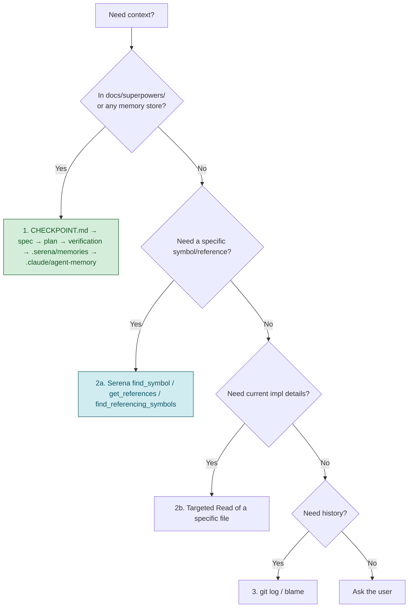
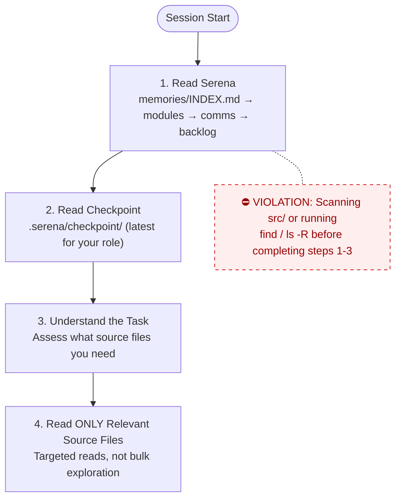
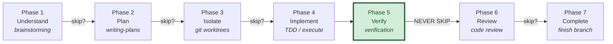
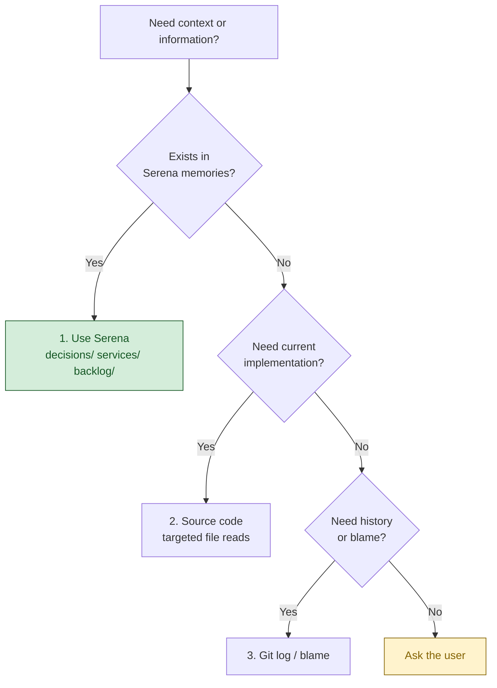
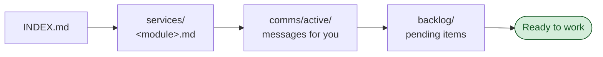
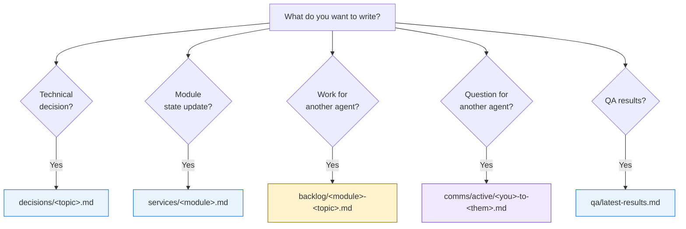

# CLAUDE.md

This file provides guidance to Claude Code (claude.ai/code) when working with
code in this repository.

## Project Overview

**Exnodes HRM API v2** is a Go rewrite of the Exnodes HRM (Human Resource
Management) backend. It is a REST API serving a web operations portal and a
mobile employee app: authentication & RBAC, employees & dependents,
departments & positions, skills/labels, leave requests, attendance,
announcements (with realtime SSE), organization settings, and
email-invite / push notifications.

The work is **phased and specification-first**. The authoritative documents are:

- [`docs/superpowers/specs/2026-05-15-go-migration-design.md`](docs/superpowers/specs/2026-05-15-go-migration-design.md)
  — full migration design and phase plan
- [`docs/superpowers/CHECKPOINT.md`](docs/superpowers/CHECKPOINT.md)
  — single resume checkpoint: current phase, what's verified, what's next
- [`docs/superpowers/plans/`](docs/superpowers/plans/) — per-phase task plans
- [`docs/superpowers/verification/`](docs/superpowers/verification/)
  — committed end-to-end verification logs (one per completed phase)
- [`ba-requirements/`](ba-requirements/) — BA-produced requirement docs
  (EPIC / US / REQUIREMENTS / FLOWCHART / TODO / detail records) for the
  web and mobile platforms; the source of feature intent

The original system being migrated lives at `exn-hr/Exn-hr/backend`; the
schema split below mirrors its patterns.

## Tech Stack

| Layer | Technology |
|---|---|
| Language | Go 1.25 (per `go.mod`, toolchain-managed) |
| HTTP framework | Gin (`gin-gonic/gin`) |
| ORM | GORM (`gorm.io/gorm` + `gorm.io/driver/postgres`) |
| Database | PostgreSQL 14+ (UUID PKs via `gen_random_uuid()`, pgcrypto) |
| Migrations | `golang-migrate/migrate/v4` — versioned SQL only |
| Auth | JWT HS256 access + refresh (`golang-jwt/jwt/v5`), bcrypt cost 12 (`golang.org/x/crypto`) |
| Authorization | In-code permission registry (RBAC), wildcard `*`, AND semantics |
| File storage | AWS SDK Go v2 S3 (`aws-sdk-go-v2/service/s3`) → Supabase S3-compatible (`STORAGE_*` env) |
| API docs | `swaggo/swag` + `gin-swagger` → `docs/swagger/` (generated) |
| Realtime | Server-Sent Events hub (`internal/sse`, introduced in the announcements phase) |
| Config | `joho/godotenv` + `.env` (DB_* or DATABASE_URL) |
| Testing | `stretchr/testify` + a Postgres-backed integration test DB |

**Current phase**: Phases 0–3 are implemented, code-reviewed, and
live-verified (auth/RBAC, users, employees & dependents, departments &
positions). Phase 4 (skills + labels) is next. **Always read
`docs/superpowers/CHECKPOINT.md` for the live status** — the table above is
a snapshot.

## Project Layout

```
cmd/server/main.go   Entry point + Swagger title/annotations
internal/
  config/            Env loader, GORM connect, boot-time migration version assert, storage config
  models/            BaseModel + per-entity GORM models
  dto/               Request/response envelopes (validation boundary)
  repositories/      GORM data access — interface + impl per entity
  services/          Business logic; returns *errors.AppError
  handlers/          Gin handlers + router.go (RegisterRoutes)
  middleware/         CORS, Recovery, ErrorHandler, JWT auth, permissions
  permissions/       Permission constant registry + groups + IsValid
  errors/            AppError type + factory helpers
  sse/               Realtime event hub (announcements phase onward)
pkg/utils/           Generic shared helpers (password.go, jwt.go, ...)
migrations/          golang-migrate SQL files: NNNNNN_<name>.up/down.sql
scripts/             Shell helpers (seed, deploy, etc.)
docs/
  superpowers/       Specs, plans, verification logs, CHECKPOINT.md
  swagger/           Generated OpenAPI — DO NOT hand-edit (regen via `make swag`)
ba-requirements/     BA requirement docs for web + mobile platforms
```

### Layering rule (one-directional)

`handler → service → repository → GORM`. Handlers never touch the DB
directly. Services never import `gin`. Repositories expose interfaces so
services are unit-testable. DTOs are the validation boundary —
self-service updates use a field-by-field whitelist copy from the DTO, so
fields absent from the DTO are silently un-updatable by design.

## Domain Modules (by phase)

| Phase | Module | Status |
|---|---|---|
| 0 | Foundation: bootable skeleton, `/health`, Swagger, migration check | ✅ done |
| 1 | Auth + RBAC: login/refresh/logout, JWT, permission registry, seed | ✅ done |
| 2 | Users + Employees + Dependents (self-service `/me` + admin) | ✅ done |
| 3 | Departments + Positions (self-referential, delete guards) | ✅ done |
| 4 | Skills + Labels | ▶ next |
| 5 | Leave requests + quota | planned |
| 6 | Attendance (check-in/out, late threshold) | planned |
| 7 | Announcements + SSE realtime | planned |
| 8 | Organization settings (company profile, attendance settings) | planned |
| 9 | Email invite + push notifications (device tokens) | planned |

**Schema split:** `users` (auth) ⟂ `employees` (HR profile) ⟂ `dependents`.
A user may have one employee record; employee creation auto-assigns the
seeded "Employee" role (carries `auth:login`) when no `role_ids` are given.

## Schema Conventions (enforced from Phase 1 onward)

- Every entity table has the four audit columns `created_at`,
  `updated_at`, `is_deleted BOOLEAN`, `deleted_at TIMESTAMPTZ`, plus a
  per-table `BEFORE UPDATE` trigger calling `set_updated_at()`.
- Primary keys are UUIDs via `gen_random_uuid()` (pgcrypto).
- Soft delete uses the custom `NotDeleted` GORM scope — **NOT** GORM's
  built-in `gorm.DeletedAt`.
- Schema changes are versioned SQL migration files only.
  `db.AutoMigrate()` is **prohibited**. The app verifies the applied
  migration version on boot and refuses to start if behind or dirty.

## Build & Run Commands

```bash
# One-time tooling
go install github.com/swaggo/swag/cmd/swag@latest
go install -tags 'postgres' github.com/golang-migrate/migrate/v4/cmd/migrate@latest
export PATH="$(go env GOPATH)/bin:$PATH"

cp .env.example .env        # set DB_* (or DATABASE_URL)

make migrate-up             # apply all pending migrations
make run                    # run API server (localhost:8080)
make build                  # build ./bin/server
make test                   # go test ./...
make test-db-up             # create the integration test DB (idempotent)
make fmt                    # gofmt -s -w .
make vet                    # go vet ./...
make swag                   # regenerate Swagger into docs/swagger/
make migrate-new name=<snake>   # new up/down migration pair
make migrate-down               # roll back one step
make migrate-version            # print applied version
make migrate-force version=N    # fix a dirty migration state only

curl -s http://localhost:8080/health | jq        # smoke test
# Swagger UI: http://localhost:8080/swagger/index.html
```

`make test` needs a reachable Postgres test DB (`exnodes_hrm_test` by
default, or `TEST_DATABASE_URL`). Run `make test-db-up` first.

## Workflow Rules

@AGENTS.md

### Superpowers Workflow

Every agent session follows this structured workflow.
Phases may be skipped for trivial tasks (< 3 steps, single file, obvious fix).
When skipping, state which phases you're skipping and why.

| Phase | Skill | When | Skip if |
|---|---|---|---|
| 1 Understand | `superpowers:brainstorming` | New feature, behavior change | Clear bug, typo, config, docs |
| 2 Plan | `superpowers:writing-plans` | 3+ steps or multi-file | Single-file obvious change |
| 3 Isolate | `superpowers:using-git-worktrees` | Feature work | Hotfix, docs-only, in-place requested |
| 4 Implement | `superpowers:test-driven-development` / `executing-plans` / `subagent-driven-development` | Always | — |
| 5 Verify | `superpowers:verification-before-completion` | **ALWAYS — never skipped** | never |
| 6 Review | `superpowers:requesting-code-review` | Feature / shared-code change | Docs/config-only or user waives |
| 7 Complete | `superpowers:finishing-a-development-branch` | Verified + reviewed | — |
| **8 Memorize** | CHECKPOINT.md + Serena memories | **ALWAYS — never skipped** | never |

On-demand at any phase: `superpowers:systematic-debugging` (unexpected
failure), `superpowers:receiving-code-review` (feedback), `superpowers:writing-skills`.

### Task Complexity Guide

| Complexity | Example | Required phases |
|---|---|---|
| Trivial | Fix typo, config value | Implement → Verify |
| Simple | Single-file bug fix, add field | Plan → Implement → Verify |
| Medium | New endpoint, new repository | Plan → Implement → Verify → Review |
| Complex | New phase/module across layers | ALL phases |

### Verification means end-to-end (per phase)

A phase is **not done** until: server runs, the API flow is exercised with
real requests (`curl` / tests), DB state is spot-checked, and a
verification log is committed to
`docs/superpowers/verification/phase-NN.md`. Unit tests alone are
insufficient. "Tests pass" is false if any were skipped — fail loud
(AGENTS.md Rule 12).

## Knowledge & Memory Protocol

This project uses **Serena MCP** for symbol-level code navigation +
project-scoped memory. Config: [`.serena/project.yml`](.serena/project.yml).
Bootstrap memory pointers (loaded on `activate_project`):
[`.serena/memories/`](.serena/memories/). The memories are **pointers**
to authoritative docs, not snapshots — agents are expected to follow the
pointer to `docs/superpowers/CHECKPOINT.md` for current state.

Consult existing knowledge before exploring source code, in this order:



### Knowledge stores

| Store | Purpose |
|---|---|
| `docs/superpowers/CHECKPOINT.md` | **Single** resume file. Current phase, verified state, next steps. Replace in place — do not append siblings. |
| `docs/superpowers/specs/` | Design specs (the migration design is authoritative). |
| `docs/superpowers/plans/` | Per-phase task lists. Tick checkboxes as tasks land. **Always check the `⚠️ REVISION NOTES` block at the top** — task bodies pre-date corrections. |
| `docs/superpowers/verification/phase-NN.md` | Committed end-to-end proof per phase. |
| `.serena/memories/` | Serena MCP project memory — **pointers** to the docs above + a `code_map.md` (where things live + naming conventions). Bootstrap-only, NOT a snapshot. Loaded on `activate_project`. |
| `.claude/agent-memory/<agent>/` | Per-agent persistent memory (`MEMORY.md` index + fact files). Read on start, write on completing non-obvious findings. Local-only (untracked). |
| `ba-requirements/` | Feature intent / acceptance source. Read before implementing a module. |
| `~/.claude/.../memory/MEMORY.md` | Main-session cross-conversation auto-memory (user prefs, project facts, feedback). |

### Session boot / resume protocol

1. Read `docs/superpowers/CHECKPOINT.md` — current phase, verified state,
   next steps, known follow-ups. Serena's `.serena/memories/resume_protocol.md`
   restates this same protocol; either entry point is fine.
2. Read the relevant spec + the current phase plan in
   `docs/superpowers/plans/` (REVISION NOTES block first).
3. Read `.claude/agent-memory/<your-agent>/MEMORY.md` (and the
   main-session memory index) for prior findings.
4. **Only now** explore source files. Prefer Serena's symbol-level tools
   (`find_symbol`, `get_references`, `find_referencing_symbols`) over
   `find` / `ls -R` / `grep` of full directory trees — they're cheaper and
   more precise. Do **not** scan `internal/` before steps 1–3.

### Mandatory end-of-session memory update (Phase 8 — never skipped)

At the end of **every** session — including interrupted or failed ones —
you **must** complete both of the following before considering the session done:

#### 1. Update `docs/superpowers/CHECKPOINT.md`

Replace in place (do not append siblings). Include:
- What was done this session and which commits land it
- What is verified (curl/tests evidence)
- What is next (immediate next task + any blockers)
- Any follow-up items or known gaps

If the session failed or was interrupted, record the failure state and
what needs to be retried. Keep it concise. This applies to all agents
and subagents (AGENTS.md Rule 10).

#### 2. Update Serena memories (`.serena/memories/`)

After any session that changes code, adds a module, or shifts the
project state, update the relevant Serena memory files:

- **`code_map.md`** — if new files, handlers, services, or repositories
  were added, append them to the map so future agents know where things live.
- **`resume_protocol.md`** — if the boot/resume steps changed (new
  knowledge stores, new required reads), update accordingly.
- Any other memory file whose pointer is now stale (e.g., phase status,
  permission list, migration version).

Serena memories are **pointers**, not snapshots — update the pointer
(e.g., "see CHECKPOINT.md") rather than duplicating content.
Use `mcp__serena__edit_memory` or `mcp__serena__write_memory` to persist.

> **Why both are mandatory:** CHECKPOINT.md is the human-readable resume
> point; Serena memories are the machine-readable bootstrap for the next
> agent session. Skipping either means the next session starts blind.

## Language Notes

Requirements are written in **Vietnamese** with English technical terms.
Key terms: Nhân viên / Employee, Người phụ thuộc / Dependent, Phòng ban /
Department, Chức vụ / Position, Đơn nghỉ phép / Leave request, Chấm công /
Attendance, Thông báo / Announcement, Phân quyền / Permission (RBAC).

<!-- gitnexus:start -->
# GitNexus — Code Intelligence

This project is indexed by GitNexus as **Go-HRM** (10895 symbols, 27496 relationships, 272 execution flows). Use the GitNexus MCP tools to understand code, assess impact, and navigate safely.

> If any GitNexus tool warns the index is stale, run `npx gitnexus analyze` in terminal first.

## Always Do

- **MUST run impact analysis before editing any symbol.** Before modifying a function, class, or method, run `gitnexus_impact({target: "symbolName", direction: "upstream"})` and report the blast radius (direct callers, affected processes, risk level) to the user.
- **MUST run `gitnexus_detect_changes()` before committing** to verify your changes only affect expected symbols and execution flows.
- **MUST warn the user** if impact analysis returns HIGH or CRITICAL risk before proceeding with edits.
- When exploring unfamiliar code, use `gitnexus_query({query: "concept"})` to find execution flows instead of grepping. It returns process-grouped results ranked by relevance.
- When you need full context on a specific symbol — callers, callees, which execution flows it participates in — use `gitnexus_context({name: "symbolName"})`.

## Never Do

- NEVER edit a function, class, or method without first running `gitnexus_impact` on it.
- NEVER ignore HIGH or CRITICAL risk warnings from impact analysis.
- NEVER rename symbols with find-and-replace — use `gitnexus_rename` which understands the call graph.
- NEVER commit changes without running `gitnexus_detect_changes()` to check affected scope.

## Resources

| Resource | Use for |
|----------|---------|
| `gitnexus://repo/Go-HRM/context` | Codebase overview, check index freshness |
| `gitnexus://repo/Go-HRM/clusters` | All functional areas |
| `gitnexus://repo/Go-HRM/processes` | All execution flows |
| `gitnexus://repo/Go-HRM/process/{name}` | Step-by-step execution trace |

## CLI

| Task | Read this skill file |
|------|---------------------|
| Understand architecture / "How does X work?" | `.claude/skills/gitnexus/gitnexus-exploring/SKILL.md` |
| Blast radius / "What breaks if I change X?" | `.claude/skills/gitnexus/gitnexus-impact-analysis/SKILL.md` |
| Trace bugs / "Why is X failing?" | `.claude/skills/gitnexus/gitnexus-debugging/SKILL.md` |
| Rename / extract / split / refactor | `.claude/skills/gitnexus/gitnexus-refactoring/SKILL.md` |
| Tools, resources, schema reference | `.claude/skills/gitnexus/gitnexus-guide/SKILL.md` |
| Index, status, clean, wiki CLI commands | `.claude/skills/gitnexus/gitnexus-cli/SKILL.md` |

<!-- gitnexus:end -->

<!-- ennam-agents-scaffold:begin v1.2.2 -->
## Agents Workflow

@AGENTS.md

### Session Boot Protocol

**Every agent MUST follow this exact sequence at session start.**
DO NOT read source code, explore directories, or scan the codebase
until you have completed steps 1-3. Source code is a last resort,
not a starting point.

1. **Read Serena** — `memories/INDEX.md` → relevant module memories → `comms/active/` → `backlog/`
2. **Read checkpoint** — `.serena/checkpoint/` for the most recent checkpoint from your role
3. **Understand the task** — you now have project context. Only NOW assess what source files you need.
4. **Read ONLY the source files relevant to your task** — targeted reads, not bulk exploration.



**Violations**: Scanning `src/`, or running `find` / `ls -R` at session start before completing steps 1-3 is a protocol violation. It wastes tokens and ignores existing knowledge.

### Superpowers Workflow

Every agent session follows this structured workflow.
Phases may be skipped for trivial tasks (< 3 steps, single file, obvious fix).
When skipping, state which phases you're skipping and why.

#### Phase 1 — Understand
**Skill**: `superpowers:brainstorming`
**When**: Creating features, modifying behavior, adding functionality.
**Skip if**: Bug fix with clear reproduction, typo, config change.
**Output**: Approved design in `docs/superpowers/specs/`

#### Phase 2 — Plan
**Skill**: `superpowers:writing-plans`
**When**: Task requires 3+ steps or touches multiple files/services.
**Skip if**: Single-file change with obvious implementation.
**Output**: Implementation plan with success criteria per step.

#### Phase 3 — Isolate
**Skill**: `superpowers:using-git-worktrees`
**When**: Feature work that should not pollute the working branch.
**Skip if**: Hotfix, docs-only change, or user requests in-place work.
**Output**: Isolated worktree or branch ready for implementation.

#### Phase 4 — Implement
**Skills** (use as needed):
- `superpowers:test-driven-development` — write tests first, then implementation
- `superpowers:executing-plans` — execute the plan from Phase 2
- `superpowers:dispatching-parallel-agents` — 2+ independent tasks
- `superpowers:subagent-driven-development` — delegate to specialized agents
- `superpowers:systematic-debugging` — when encountering failures during implementation
**Output**: Working code with tests.

#### Phase 5 — Verify
**Skill**: `superpowers:verification-before-completion`
**When**: ALWAYS. This phase is never skipped.
**Output**: Evidence that success criteria are met (test output, build output).

#### Phase 6 — Review
**Skill**: `superpowers:requesting-code-review`
**When**: Feature work, significant changes, anything touching shared code.
**Skip if**: Docs-only, config-only, or user explicitly waives review.
**Output**: Review feedback addressed.

#### Phase 7 — Complete
**Skill**: `superpowers:finishing-a-development-branch`
**When**: Implementation verified and reviewed.
**Output**: PR created, branch merged, or completion option presented to user.

#### Workflow Diagram



#### On-Demand Skills (any phase)
- `superpowers:systematic-debugging` — when hitting unexpected failures
- `superpowers:receiving-code-review` — when receiving feedback from others
- `superpowers:writing-skills` — when creating/modifying workflow skills

### Task Complexity Guide

| Complexity | Example | Required Phases |
|-----------|---------|-----------------|
| **Trivial** | Fix typo, update config value | Implement → Verify |
| **Simple** | Single-file bug fix, add field | Plan → Implement → Verify |
| **Medium** | New endpoint, new component | Plan → Implement → Verify → Review |
| **Complex** | New feature across services | ALL phases |

### Knowledge Source Priority

Agents MUST consult existing knowledge before exploring source code.

#### Retrieval order (strict)



1. **Serena memories** — primary source for decisions, architecture context, conventions, and inter-agent communication
2. **Source code / git log** — when you need exact current implementation details

#### When to read from Serena

| Moment | Action |
|--------|--------|
| Session start | Read `memories/INDEX.md` — understand what's been decided, what's in progress |
| Before coding a function | Check `services/<module>.md` — check related decisions and conventions |
| Before making a design decision | Search `decisions/` — check for prior decisions on same topic |
| When encountering unfamiliar code | Check memories — there may be a decision or discovery explaining it |

#### When to write to Serena

| Moment | Action |
|--------|--------|
| After making a design decision | Write to `memories/decisions/<topic>.md` |
| After discovering something non-obvious | Write to `memories/decisions/<topic>.md` |
| After completing a task | Update checkpoint + relevant service memory |
| When identifying work for another agent | Write to `memories/backlog/<service>-<topic>.md` |

### Serena MCP Protocol (canonical — defines *how*; overrides file-path wording below)

**All `.serena/memories/` I/O goes through Serena MCP tools (`mcp__serena__*`). NEVER hand-edit memory files** with Read/Edit/Write — Serena indexes memories and resolves `` `mem:` `` links; hand-editing bypasses both.

**Session start (before reading source):**
1. `mcp__serena__activate_project` for this repo **by path** → `mcp__serena__initial_instructions` (loads the manual + lists available memories).
2. `mcp__serena__read_memory`: `INDEX` → relevant `decisions/` / `services/` → `comms/active/` → `backlog/` → latest `checkpoint/`.

**Writing:** `mcp__serena__write_memory(name, content)` — names use `/` topics (`decisions/…`, `services/…`, `backlog/…`, `comms/active/…`, `qa/…`, `checkpoint/…`); link memories as `` `mem:<name>` ``. Use `mcp__serena__edit_memory` for targeted edits and `mcp__serena__delete_memory` when an item is done.

**Checkpoint (end of EVERY session):** `mcp__serena__write_memory("checkpoint/<agent-name>-<YYYY-MM-DD>", …)` → stored at `.serena/memories/checkpoint/<agent-name>-<YYYY-MM-DD>.md`.

> The subsections below (Session Boot / Knowledge Source / Serena Memory Protocol / checkpoint) remain the reference for *what* to read/write and *where things go*; **this block is authoritative for *how*** — always via Serena MCP, checkpoints under `memories/checkpoint/`.

### Mandatory Session Checkpoint

**All AI agents MUST write a checkpoint at the end of every session — via Serena MCP** (`mcp__serena__write_memory`).

**Format**: `mcp__serena__write_memory("checkpoint/<agent-name>-<YYYY-MM-DD>", …)` → stored at `.serena/memories/checkpoint/<agent-name>-<YYYY-MM-DD>.md`. Write through Serena MCP, **never** by hand-editing the file.

**Required content**:

```markdown
# Checkpoint: <agent-name> — <date>

## What was done
- <bullet list of completed work>

## Files changed
- <list of files created/modified/deleted>

## Current state
- <what is working, what is broken, what is partially done>

## Next steps
- <what the next session should pick up>

## Blockers / Risks
- <anything that could block progress>
```

**Rules**:
- Write checkpoint BEFORE ending the session — no exceptions
- If the session was interrupted or failed, still write a checkpoint noting the failure
- One file per agent per day; append if multiple sessions in the same day
- Keep each checkpoint concise (under 50 lines)
- This applies to ALL agents: any subagents, specialized agents, or the main session agent

### Serena Memory Protocol

Serena is the project's knowledge store for decisions, conventions, service state, and inter-agent communication.
All agents MUST follow these rules when reading/writing to `.serena/memories/`.

#### Read Protocol — Session Start



1. Read `memories/INDEX.md` first
2. Read `services/<your-module>.md` for current state
3. Check `comms/active/` for messages addressed to you
4. Check `backlog/` for pending action items in your domain

#### Write Protocol — What goes where



| You want to... | Write to | Naming |
|----------------|----------|--------|
| Record a technical decision | `decisions/<topic>.md` | Descriptive topic name |
| Update module/service state | `services/<module>.md` | Append or replace section |
| Flag work for another agent | `backlog/<module>-<topic>.md` | Prefix with target module |
| Ask another agent a question | `comms/active/<you>-to-<them>-<topic>.md` | |
| Respond to a question | Append to the existing file in `comms/active/` | |
| Close a resolved thread | Move both files to `comms/resolved/` | |
| Report QA results | `qa/latest-results.md` (replace) | Keep only latest |
| Store something historical | `archive/<category>/` | |

#### Rules

- **Never create new top-level directories** under `memories/`
- **Never put files directly in `memories/`** — always in a subdirectory
- **1 file per module** in `services/` — update, don't create siblings
- **Backlog items**: delete the file when the work is done
- **Comms**: respond within the SAME file (append), don't create
  a separate response file. Move to `resolved/` when done.
- **Decisions**: only for choices that affect future work. Don't store
  implementation details — those belong in code comments.
- **Update INDEX.md** when adding new files to `decisions/` or `services/`
- **QA**: `latest-results.md` is overwritten each run. Archive old
  results to `archive/qa-runs/<date>.md` before overwriting.

### Profile: go

## Stack: Go 1.24 + stdlib net/http

| Layer | Tech |
|---|---|
| Language | Go 1.24+ |
| HTTP | stdlib `net/http` (ServeMux from 1.22+) |
| DB | pgx (PostgreSQL) |
| Migrations | golang-migrate |
| Logging | stdlib `log/slog` |
| Testing | stdlib `testing` + `testify/assert` only for assertions |

### Conventions

- **No web frameworks.** stdlib net/http with the new ServeMux is enough.
- **pgx for Postgres** — never database/sql.
- **slog** for all logging — never fmt.Println in non-test code.
- **Errors:** wrap with `fmt.Errorf("doing X: %w", err)`. No panic in handlers.
- **Type-check before declaring done:** `go vet ./... && go test ./...`.

### Common commands

```bash
go mod tidy
go run ./cmd/server
go test ./...
go vet ./...
go build -o bin/server ./cmd/server
```

<!-- ennam-agents-scaffold:end -->
