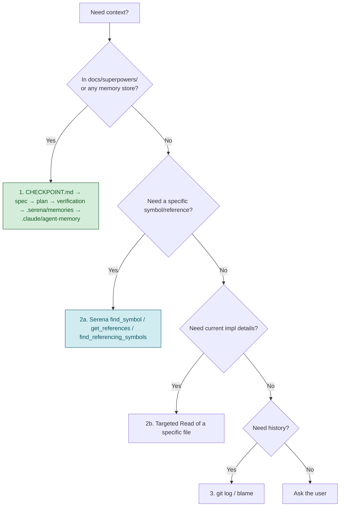

# CLAUDE.md

This file provides guidance to Claude Code (claude.ai/code) when working with
code in this repository.

## Project Overview

**Exnodes HRM API v2** is a Go rewrite of the Exnodes HRM (Human Resource
Management) backend. It is a REST API serving a web operations portal and a
mobile employee app: authentication & RBAC, employees & dependents,
departments & positions, skills/labels, leave requests, attendance,
announcements (with realtime SSE), organization settings, and
email-invite / push notifications.

The work is **phased and specification-first**. The authoritative documents are:

- [`docs/superpowers/specs/2026-05-15-go-migration-design.md`](docs/superpowers/specs/2026-05-15-go-migration-design.md)
  — full migration design and phase plan
- [`docs/superpowers/CHECKPOINT.md`](docs/superpowers/CHECKPOINT.md)
  — single resume checkpoint: current phase, what's verified, what's next
- [`docs/superpowers/plans/`](docs/superpowers/plans/) — per-phase task plans
- [`docs/superpowers/verification/`](docs/superpowers/verification/)
  — committed end-to-end verification logs (one per completed phase)
- [`ba-requirements/`](ba-requirements/) — BA-produced requirement docs
  (EPIC / US / REQUIREMENTS / FLOWCHART / TODO / detail records) for the
  web and mobile platforms; the source of feature intent

The original system being migrated lives at `exn-hr/Exn-hr/backend`; the
schema split below mirrors its patterns.

## Tech Stack

| Layer | Technology |
|---|---|
| Language | Go 1.25 (per `go.mod`, toolchain-managed) |
| HTTP framework | Gin (`gin-gonic/gin`) |
| ORM | GORM (`gorm.io/gorm` + `gorm.io/driver/postgres`) |
| Database | PostgreSQL 14+ (UUID PKs via `gen_random_uuid()`, pgcrypto) |
| Migrations | `golang-migrate/migrate/v4` — versioned SQL only |
| Auth | JWT HS256 access + refresh (`golang-jwt/jwt/v5`), bcrypt cost 12 (`golang.org/x/crypto`) |
| Authorization | In-code permission registry (RBAC), wildcard `*`, AND semantics |
| File storage | AWS SDK Go v2 S3 (`aws-sdk-go-v2/service/s3`) → Supabase S3-compatible (`STORAGE_*` env) |
| API docs | `swaggo/swag` + `gin-swagger` → `docs/swagger/` (generated) |
| Realtime | Server-Sent Events hub (`internal/sse`, introduced in the announcements phase) |
| Config | `joho/godotenv` + `.env` (DB_* or DATABASE_URL) |
| Testing | `stretchr/testify` + a Postgres-backed integration test DB |

**Current phase**: Phases 0–3 are implemented, code-reviewed, and
live-verified (auth/RBAC, users, employees & dependents, departments &
positions). Phase 4 (skills + labels) is next. **Always read
`docs/superpowers/CHECKPOINT.md` for the live status** — the table above is
a snapshot.

## Project Layout

```
cmd/server/main.go   Entry point + Swagger title/annotations
internal/
  config/            Env loader, GORM connect, boot-time migration version assert, storage config
  models/            BaseModel + per-entity GORM models
  dto/               Request/response envelopes (validation boundary)
  repositories/      GORM data access — interface + impl per entity
  services/          Business logic; returns *errors.AppError
  handlers/          Gin handlers + router.go (RegisterRoutes)
  middleware/         CORS, Recovery, ErrorHandler, JWT auth, permissions
  permissions/       Permission constant registry + groups + IsValid
  errors/            AppError type + factory helpers
  sse/               Realtime event hub (announcements phase onward)
pkg/utils/           Generic shared helpers (password.go, jwt.go, ...)
migrations/          golang-migrate SQL files: NNNNNN_<name>.up/down.sql
scripts/             Shell helpers (seed, deploy, etc.)
docs/
  superpowers/       Specs, plans, verification logs, CHECKPOINT.md
  swagger/           Generated OpenAPI — DO NOT hand-edit (regen via `make swag`)
ba-requirements/     BA requirement docs for web + mobile platforms
```

### Layering rule (one-directional)

`handler → service → repository → GORM`. Handlers never touch the DB
directly. Services never import `gin`. Repositories expose interfaces so
services are unit-testable. DTOs are the validation boundary —
self-service updates use a field-by-field whitelist copy from the DTO, so
fields absent from the DTO are silently un-updatable by design.

## Domain Modules (by phase)

| Phase | Module | Status |
|---|---|---|
| 0 | Foundation: bootable skeleton, `/health`, Swagger, migration check | ✅ done |
| 1 | Auth + RBAC: login/refresh/logout, JWT, permission registry, seed | ✅ done |
| 2 | Users + Employees + Dependents (self-service `/me` + admin) | ✅ done |
| 3 | Departments + Positions (self-referential, delete guards) | ✅ done |
| 4 | Skills + Labels | ▶ next |
| 5 | Leave requests + quota | planned |
| 6 | Attendance (check-in/out, late threshold) | planned |
| 7 | Announcements + SSE realtime | planned |
| 8 | Organization settings (company profile, attendance settings) | planned |
| 9 | Email invite + push notifications (device tokens) | planned |

**Schema split:** `users` (auth) ⟂ `employees` (HR profile) ⟂ `dependents`.
A user may have one employee record; employee creation auto-assigns the
seeded "Employee" role (carries `auth:login`) when no `role_ids` are given.

## Schema Conventions (enforced from Phase 1 onward)

- Every entity table has the four audit columns `created_at`,
  `updated_at`, `is_deleted BOOLEAN`, `deleted_at TIMESTAMPTZ`, plus a
  per-table `BEFORE UPDATE` trigger calling `set_updated_at()`.
- Primary keys are UUIDs via `gen_random_uuid()` (pgcrypto).
- Soft delete uses the custom `NotDeleted` GORM scope — **NOT** GORM's
  built-in `gorm.DeletedAt`.
- Schema changes are versioned SQL migration files only.
  `db.AutoMigrate()` is **prohibited**. The app verifies the applied
  migration version on boot and refuses to start if behind or dirty.

## Build & Run Commands

```bash
# One-time tooling
go install github.com/swaggo/swag/cmd/swag@latest
go install -tags 'postgres' github.com/golang-migrate/migrate/v4/cmd/migrate@latest
export PATH="$(go env GOPATH)/bin:$PATH"

cp .env.example .env        # set DB_* (or DATABASE_URL)

make migrate-up             # apply all pending migrations
make run                    # run API server (localhost:8080)
make build                  # build ./bin/server
make test                   # go test ./...
make test-db-up             # create the integration test DB (idempotent)
make fmt                    # gofmt -s -w .
make vet                    # go vet ./...
make swag                   # regenerate Swagger into docs/swagger/
make migrate-new name=<snake>   # new up/down migration pair
make migrate-down               # roll back one step
make migrate-version            # print applied version
make migrate-force version=N    # fix a dirty migration state only

curl -s http://localhost:8080/health | jq        # smoke test
# Swagger UI: http://localhost:8080/swagger/index.html
```

`make test` needs a reachable Postgres test DB (`exnodes_hrm_test` by
default, or `TEST_DATABASE_URL`). Run `make test-db-up` first.

## Workflow Rules

@AGENTS.md

### Superpowers Workflow

Every agent session follows this structured workflow.
Phases may be skipped for trivial tasks (< 3 steps, single file, obvious fix).
When skipping, state which phases you're skipping and why.

| Phase | Skill | When | Skip if |
|---|---|---|---|
| 1 Understand | `superpowers:brainstorming` | New feature, behavior change | Clear bug, typo, config, docs |
| 2 Plan | `superpowers:writing-plans` | 3+ steps or multi-file | Single-file obvious change |
| 3 Isolate | `superpowers:using-git-worktrees` | Feature work | Hotfix, docs-only, in-place requested |
| 4 Implement | `superpowers:test-driven-development` / `executing-plans` / `subagent-driven-development` | Always | — |
| 5 Verify | `superpowers:verification-before-completion` | **ALWAYS — never skipped** | never |
| 6 Review | `superpowers:requesting-code-review` | Feature / shared-code change | Docs/config-only or user waives |
| 7 Complete | `superpowers:finishing-a-development-branch` | Verified + reviewed | — |

On-demand at any phase: `superpowers:systematic-debugging` (unexpected
failure), `superpowers:receiving-code-review` (feedback), `superpowers:writing-skills`.

### Task Complexity Guide

| Complexity | Example | Required phases |
|---|---|---|
| Trivial | Fix typo, config value | Implement → Verify |
| Simple | Single-file bug fix, add field | Plan → Implement → Verify |
| Medium | New endpoint, new repository | Plan → Implement → Verify → Review |
| Complex | New phase/module across layers | ALL phases |

### Verification means end-to-end (per phase)

A phase is **not done** until: server runs, the API flow is exercised with
real requests (`curl` / tests), DB state is spot-checked, and a
verification log is committed to
`docs/superpowers/verification/phase-NN.md`. Unit tests alone are
insufficient. "Tests pass" is false if any were skipped — fail loud
(AGENTS.md Rule 12).

## Knowledge & Memory Protocol

This project uses **Serena MCP** for symbol-level code navigation +
project-scoped memory. Config: [`.serena/project.yml`](.serena/project.yml).
Bootstrap memory pointers (loaded on `activate_project`):
[`.serena/memories/`](.serena/memories/). The memories are **pointers**
to authoritative docs, not snapshots — agents are expected to follow the
pointer to `docs/superpowers/CHECKPOINT.md` for current state.

Consult existing knowledge before exploring source code, in this order:



### Knowledge stores

| Store | Purpose |
|---|---|
| `docs/superpowers/CHECKPOINT.md` | **Single** resume file. Current phase, verified state, next steps. Replace in place — do not append siblings. |
| `docs/superpowers/specs/` | Design specs (the migration design is authoritative). |
| `docs/superpowers/plans/` | Per-phase task lists. Tick checkboxes as tasks land. **Always check the `⚠️ REVISION NOTES` block at the top** — task bodies pre-date corrections. |
| `docs/superpowers/verification/phase-NN.md` | Committed end-to-end proof per phase. |
| `.serena/memories/` | Serena MCP project memory — **pointers** to the docs above + a `code_map.md` (where things live + naming conventions). Bootstrap-only, NOT a snapshot. Loaded on `activate_project`. |
| `.claude/agent-memory/<agent>/` | Per-agent persistent memory (`MEMORY.md` index + fact files). Read on start, write on completing non-obvious findings. Local-only (untracked). |
| `ba-requirements/` | Feature intent / acceptance source. Read before implementing a module. |
| `~/.claude/.../memory/MEMORY.md` | Main-session cross-conversation auto-memory (user prefs, project facts, feedback). |

### Session boot / resume protocol

1. Read `docs/superpowers/CHECKPOINT.md` — current phase, verified state,
   next steps, known follow-ups. Serena's `.serena/memories/resume_protocol.md`
   restates this same protocol; either entry point is fine.
2. Read the relevant spec + the current phase plan in
   `docs/superpowers/plans/` (REVISION NOTES block first).
3. Read `.claude/agent-memory/<your-agent>/MEMORY.md` (and the
   main-session memory index) for prior findings.
4. **Only now** explore source files. Prefer Serena's symbol-level tools
   (`find_symbol`, `get_references`, `find_referencing_symbols`) over
   `find` / `ls -R` / `grep` of full directory trees — they're cheaper and
   more precise. Do **not** scan `internal/` before steps 1–3.

### Mandatory checkpoint discipline

Update `docs/superpowers/CHECKPOINT.md` at the end of every significant
session: what was done, what is verified, what is next, blockers. If a
session was interrupted or failed, still update it noting the failure.
Keep it concise. This applies to all agents and subagents (AGENTS.md
Rule 10).

## Language Notes

Requirements are written in **Vietnamese** with English technical terms.
Key terms: Nhân viên / Employee, Người phụ thuộc / Dependent, Phòng ban /
Department, Chức vụ / Position, Đơn nghỉ phép / Leave request, Chấm công /
Attendance, Thông báo / Announcement, Phân quyền / Permission (RBAC).
