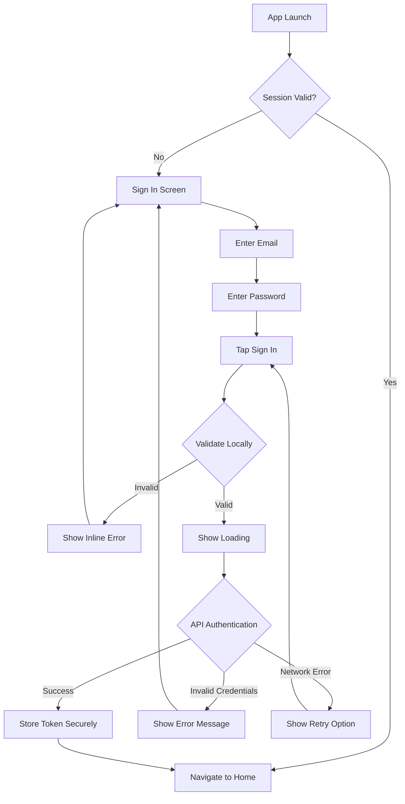
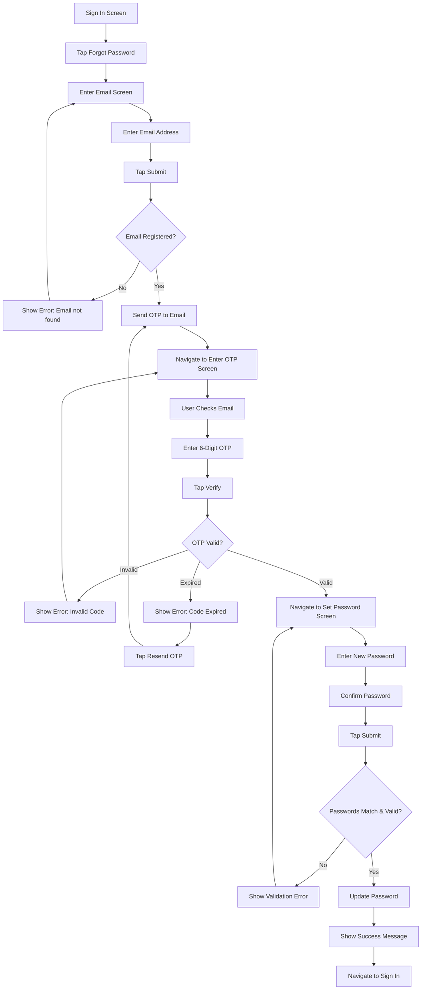
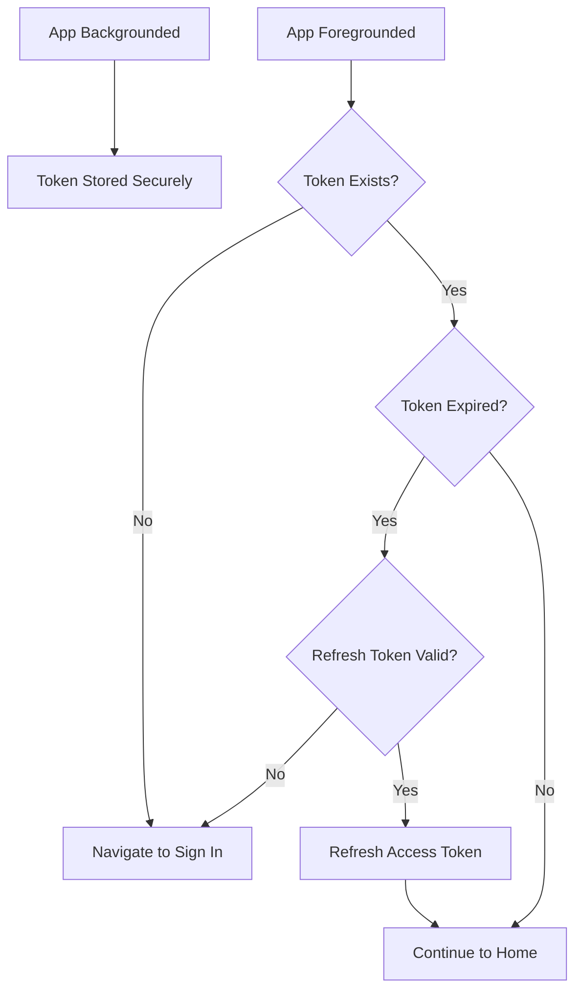
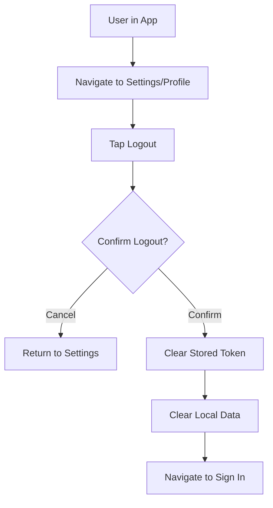

# Flowcharts: Authentication

**Epic:** EP-001 (Foundation)
**Story:** US-001-authentication
**Platform:** MOBILE-APP

---

## 1. Sign In Flow

---

## 2. Forgot Password Flow (OTP)

---

## 3. Session Management Flow

---

## 4. Logout Flow

---

**Document Version:** 1.0
**Last Updated:** 2026-04-16
**Author:** BA Team
