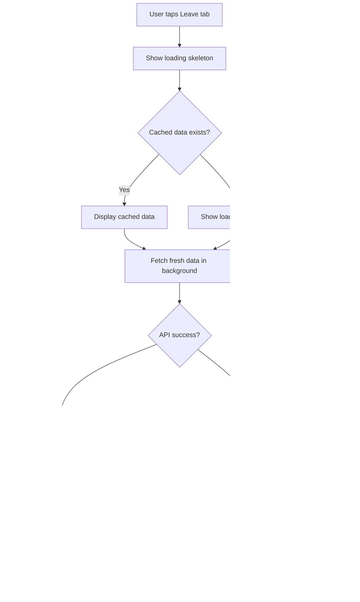
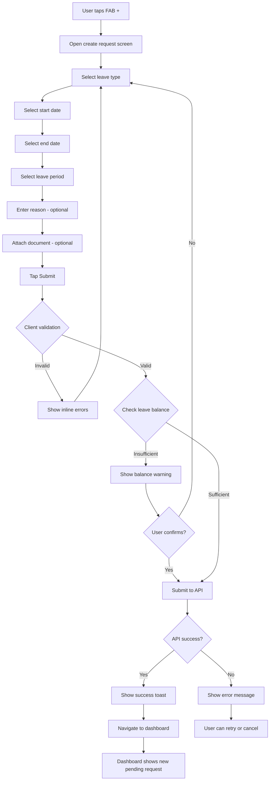
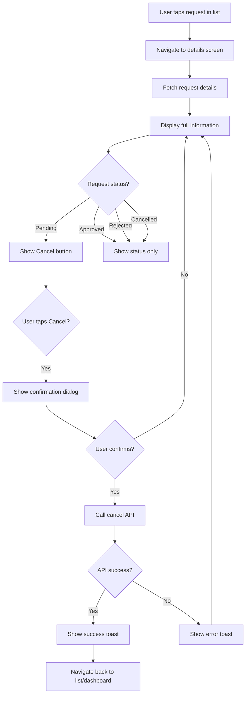
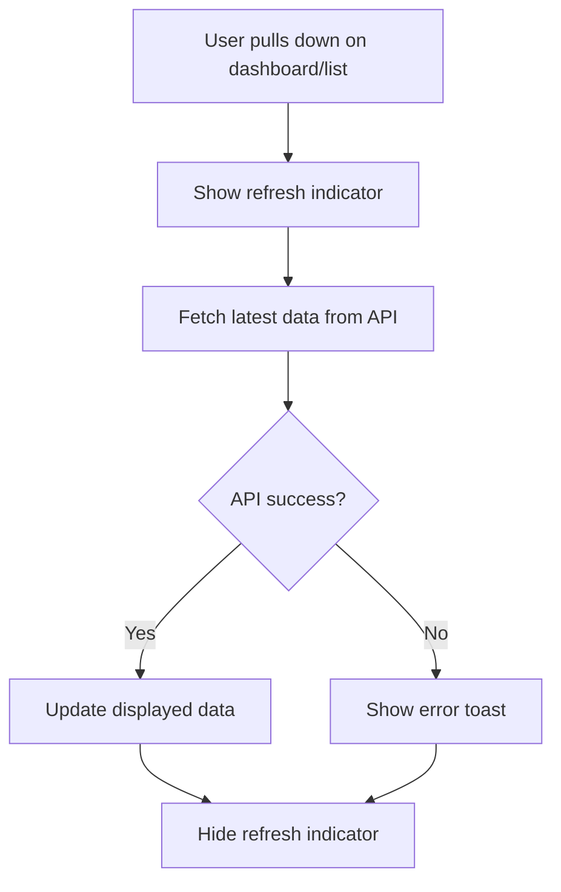
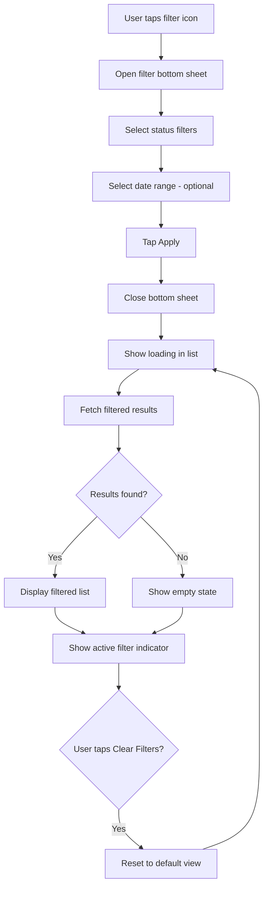

# Flowcharts: Leave Requests

**Epic:** EP-002 (Leave Management)
**Story:** US-001-leave-requests
**Platform:** MOBILE-APP

---

## 1. Dashboard Load Flow

---

## 2. Create Leave Request Flow

---

## 3. View Request Details Flow

---

## 4. Pull-to-Refresh Flow

---

## 5. Filter Request List Flow

---

**Document Version:** 1.0
**Last Updated:** 2026-04-16
**Author:** BA Team
