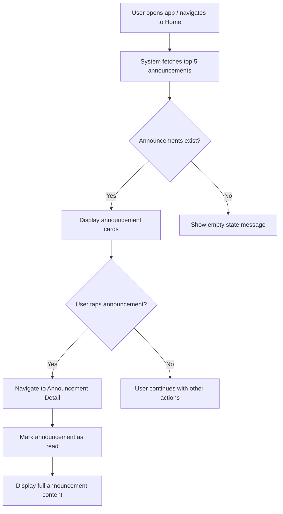
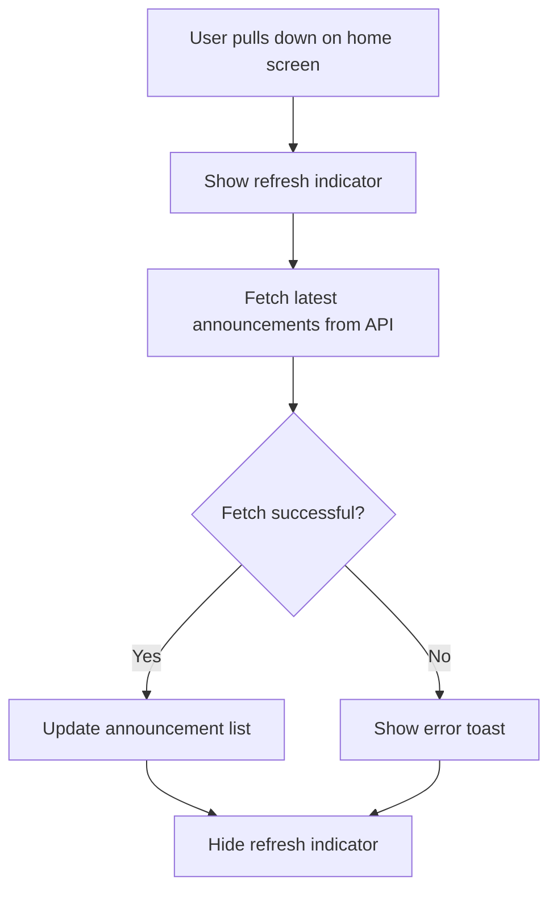
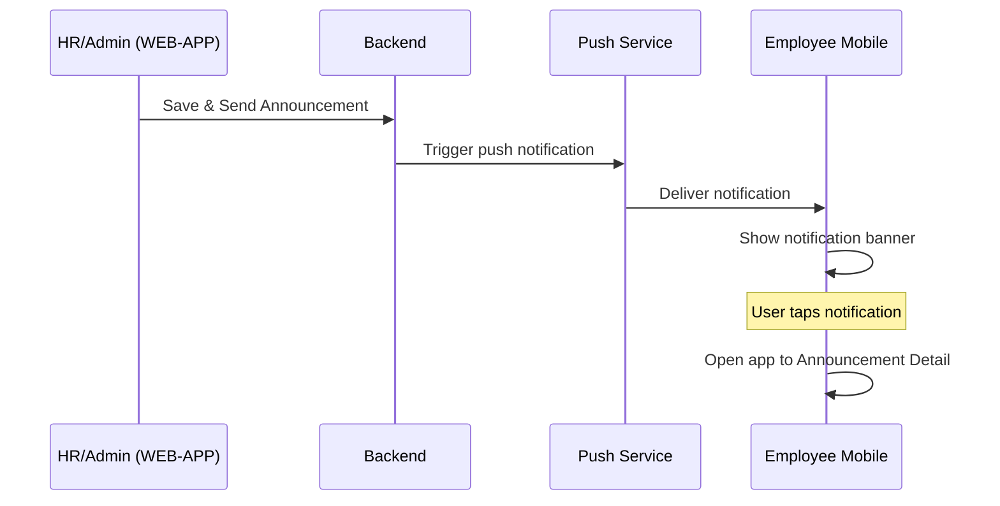

# Business Process Flowcharts: Home Announcements

**Epic:** EP-004 (Announcements)
**Story:** US-001-home-announcements
**Last Updated:** 2026-04-28

---

## 1. View Announcements on Home Screen

---

## 2. Pull-to-Refresh Flow

---

## 3. Push Notification Flow

---

## Notes & Assumptions

### Notes

- Home screen shows maximum 5 announcements
- Only "Sent" status announcements are displayed (not Draft)
- Announcements ordered by Sent Date descending (newest first)

### Assumptions

- User must be authenticated to see announcements
- Announcements targeted to "Everyone" or specifically to the user are shown
- Read status is tracked per user per announcement
