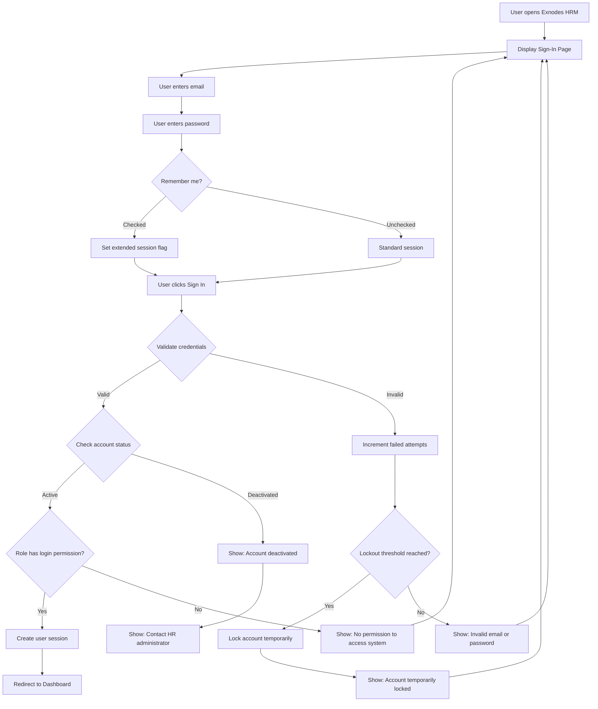
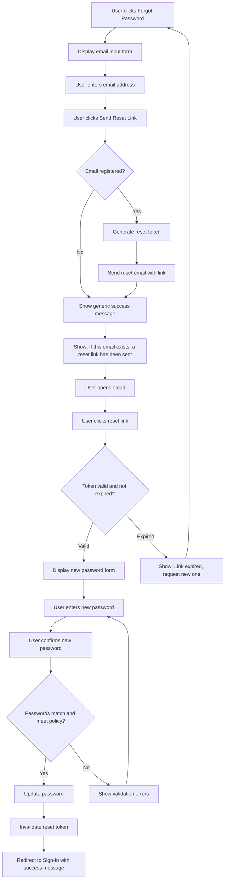
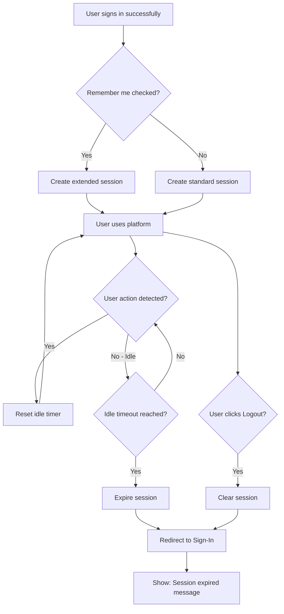
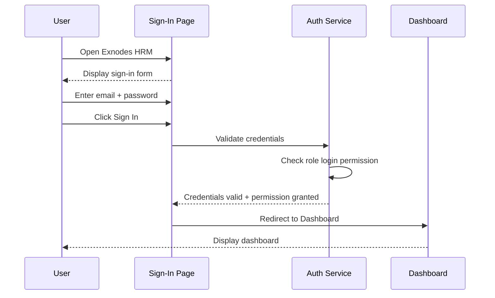
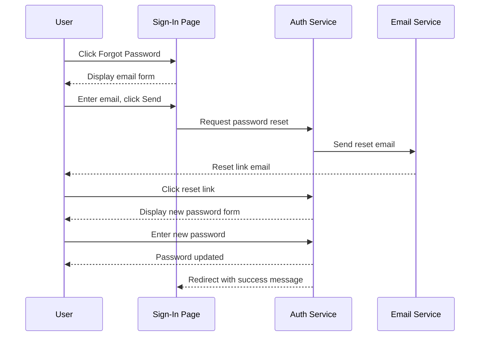
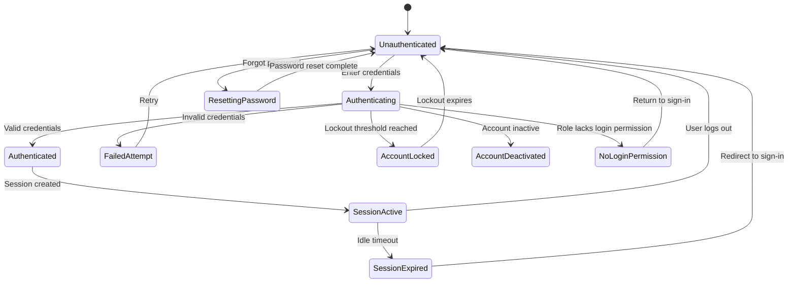
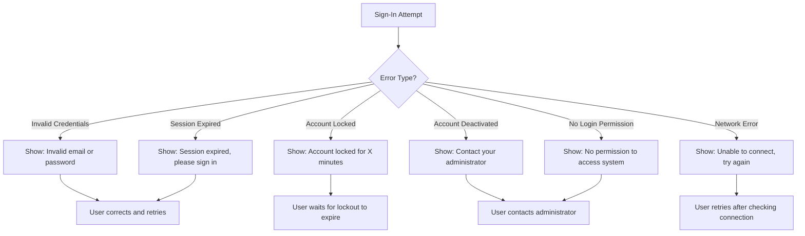

# Business Process Flowcharts: User Authentication

**Epic:** EP-001 (Foundation)
**Story:** US-001-authentication
**Last Updated:** 2026-02-26

---

## Table of Contents

1. [Sign-In Process Flow](#1-sign-in-process-flow)
2. [Password Reset Flow](#2-password-reset-flow)
3. [Session Management Flow](#3-session-management-flow)
4. [Actor Interactions](#4-actor-interactions)
5. [State Diagram](#5-state-diagram)
6. [Error Handling](#6-error-handling)
7. [Notes & Assumptions](#7-notes--assumptions)

---

## 1. Sign-In Process Flow

### Overall Sign-In Flow

### Key Steps

1. **Display Sign-In Page** — Centered card with email, password, remember me, and sign-in button
2. **Credential Validation** — System checks email/password against stored credentials
3. **Account Status Check** — Verifies account is active (not deactivated or locked)
4. **Login Permission Check** — Verifies user's assigned role has login permission (roles are configurable via US-004)
5. **Dashboard Redirect** — Authenticated user redirected to Dashboard

---

## 2. Password Reset Flow

### Forgot Password Flow

### Key Steps

1. **Initiate Reset** — User clicks "Forgot Password" on sign-in page
2. **Email Verification** — System checks if email exists (but never reveals this to user)
3. **Token Generation** — Secure, single-use, time-limited reset link
4. **Password Update** — User sets new password meeting policy requirements
5. **Redirect** — User returns to sign-in page with confirmation message

---

## 3. Session Management Flow

### Session Lifecycle

---

## 4. Actor Interactions

### Sign-In Sequence

### Password Reset Sequence

---

## 5. State Diagram

### User Authentication States

**States:**
- **Unauthenticated:** User is on sign-in page, no active session
- **Authenticating:** Credentials being validated
- **Authenticated:** Credentials valid, session being created
- **SessionActive:** User is using the platform
- **SessionExpired:** Idle timeout reached, session invalidated
- **FailedAttempt:** Invalid credentials, user can retry
- **AccountLocked:** Too many failed attempts, temporarily locked
- **AccountDeactivated:** Account disabled by administrator
- **NoLoginPermission:** User's role does not have login permission
- **ResettingPassword:** User is in password reset flow

---

## 6. Error Handling

### Error Recovery Flow

**Error Types:**
- **Recoverable:** Invalid credentials, network error, session expired — user can retry
- **Requires Action:** Account locked (wait), Account deactivated (contact administrator), No login permission (contact administrator)

---

## 7. Notes & Assumptions

### Assumptions

1. Authentication service is available as a backend dependency
2. Email service is configured for transactional emails (password reset)
3. All user roles use the same sign-in page and flow (roles are configurable via US-004)
4. Password policies are configurable but have sensible defaults

### Future Enhancements

- [ ] Multi-factor authentication (MFA)
- [ ] Social login / SSO integration
- [ ] Biometric authentication (mobile)
- [ ] "Sign in as" feature for administrators (impersonation for support)

---

**Document Control:**
- **Version:** 1.0
- **Status:** Draft
- **Last Updated:** 2026-02-26
