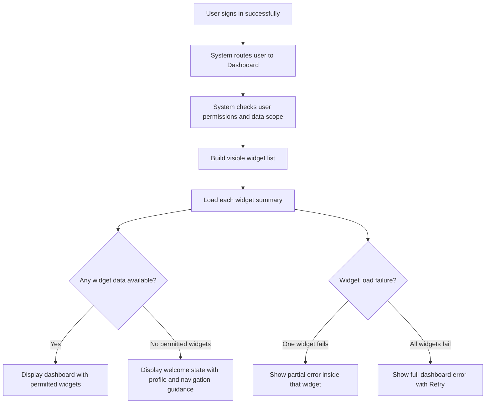
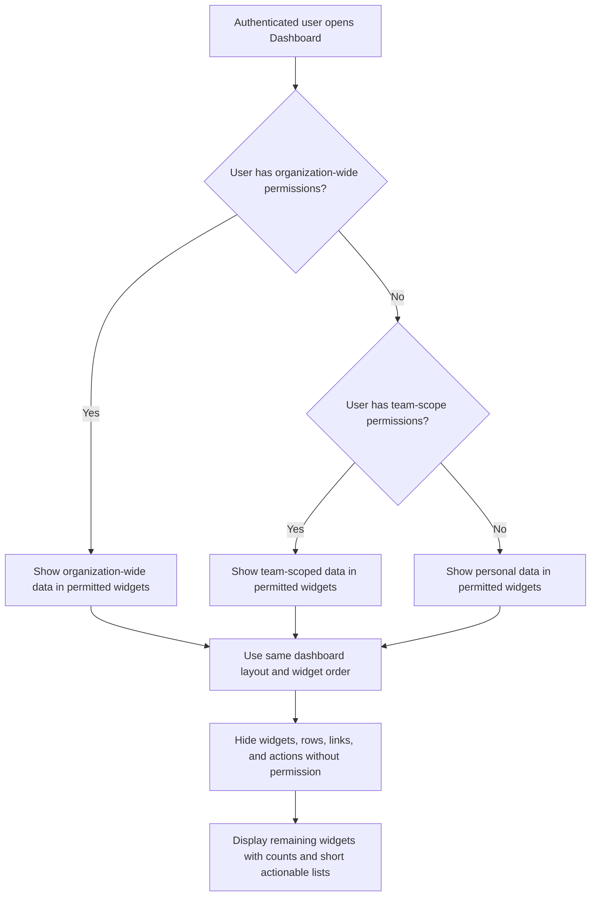
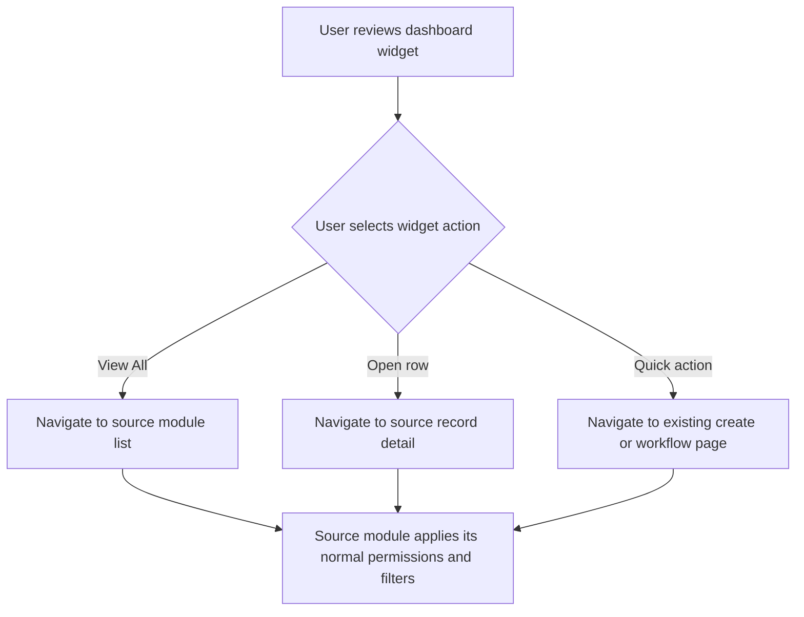

# Business Process Flowcharts: Dashboard

**Epic:** EP-001 (Foundation)
**Story:** US-002-dashboard

---

## 1. Dashboard Load After Sign In

---

## 2. Permission-Controlled Dashboard Composition

---

## 3. Widget Navigation

---

## Notes

- Dashboard does not perform create, edit, delete, approve, reject, send, or close actions inline.
- Source module pages remain authoritative for record actions and detail views.
- Dashboard uses one common layout; permissions determine which widgets and actions are visible.
