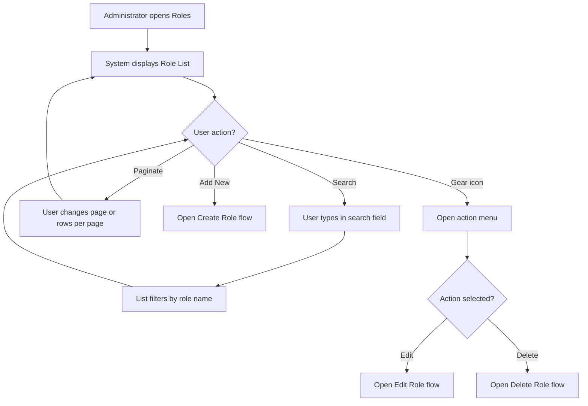
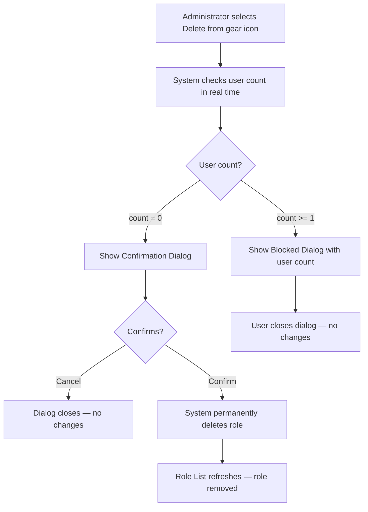

# Business Process Flowcharts: Role & Permission Management

**Epic:** EP-001 (Foundation)
**Story:** US-004-role-permission-management
**Status:** 🔴 Draft — Stub (pending full flowchart elaboration)
**Last Updated:** 2026-03-19

---

> **Note:** This is a stub document. Full flowcharts will be created after Create/Edit Role designs are delivered and open questions are resolved.

---

## 1. Role List Flow (Preliminary)

---

## 2. Delete Role Flow (Preliminary)

---

**Document Control:**
- **Version:** 0.1
- **Status:** Draft — Stub
- **Last Updated:** 2026-03-19
