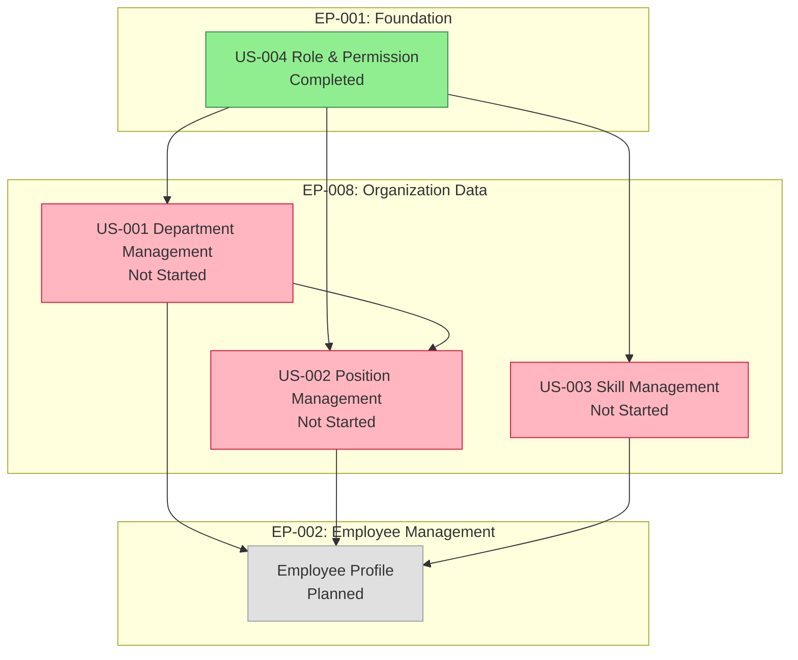

# EP-008: Organization Data

> **Epic** | **Platform:** Exnodes HRM (Web Application) | **Status:** Approved

---

## Quick Reference

| Attribute | Value |
|-----------|-------|
| **Status** | 🔴 Not Started |
| **Prerequisites** | EP-001 (Foundation) — Authentication and Role & Permission must be operational |
| **Business Objective** | Establish and maintain the core organizational reference data that all HR modules depend on |

---

## 1. Business Context

### Overview

Before any HR operation can take place — hiring an employee, processing payroll, or approving a leave request — the organization's structure must be defined. Organization Data is the master reference layer of Exnodes HRM: it captures the fundamental building blocks of the business, such as departments and job positions, that all other modules reference.

Without this foundation, HR administrators cannot assign employees to departments, managers cannot scope their team visibility, and payroll cannot apply department-level rules. This epic delivers the tools to define, manage, and maintain organizational reference data as the business grows and changes.

This epic is intentionally scoped to pure reference data management — no workflows, approvals, or reporting are included. It serves as a shared data foundation consumed by Employee Management (EP-002), Payroll (EP-004), and other downstream modules.

### Target Users

- **Administrator (with permission)**: Defines and maintains the organizational structure — creates departments, assigns positions, manages hierarchies, and deactivates outdated entries
- **Manager (read access)**: Views department and position information relevant to their team for context in approvals and reviews
- **All modules (system)**: Reference department and position data when creating employee profiles, processing payroll, and generating reports

### Business Problems Solved

1. **No Defined Org Structure**: Organizations currently manage department/position data in spreadsheets with no single source of truth → this epic creates a centralized, authoritative organizational reference
2. **Inconsistent Data Across HR Processes**: When departments and positions are not standardized, employee records, payroll rules, and reports are inconsistent → this epic enforces consistent reference data used system-wide
3. **Manual Updates When Org Changes**: Department restructures or new positions require manual updates across multiple files → administrators can update organization data once and all modules reflect the change

### Business Outcomes

- **Single Source of Truth**: All HR modules reference the same department and position records, eliminating inconsistency
- **Scalable Org Structure**: As the business grows, administrators can easily add departments, create sub-departments, and define new positions without disrupting existing records
- **Faster Employee Onboarding**: When a new employee joins, their department and position are selected from a validated list, reducing data entry errors

---

## 2. Stories Overview

This epic contains **3** user stories:

> **Story ID Format:** `US-XXX` where XXX = Story sequence (001-999)
> **Full Path:** `WEB-APP/EP-008-organization-data/US-XXX-[story-name]/`

---

### US-001: Department Management

**Business Purpose:** Enable administrators to define and maintain the organization's department structure, including hierarchical parent-child relationships

**Key Deliverables:**
- Department list view with search and filter
- Create / edit / deactivate department form (flat list — name field only)
- Department status management (active / inactive)

**User Value:** Administrators can maintain an accurate reflection of the business's organizational units, which other modules use to scope employee assignments, approvals, and reports

**Status:** In Progress

**Documentation:** [US-001-department-management/](./US-001-department-management/)
- [ANALYSIS.md](./US-001-department-management/ANALYSIS.md) - Business analysis (includes Figma design context)
- [REQUIREMENTS.md](./US-001-department-management/REQUIREMENTS.md) - User stories & acceptance criteria
- [FLOWCHART.md](./US-001-department-management/FLOWCHART.md) - Process diagrams
- [TODO.yaml](./US-001-department-management/TODO.yaml) - Task tracking (4/12 complete)

---

### US-002: Position Management

**Business Purpose:** Enable administrators to define and maintain job positions / job titles used across the organization

**Key Deliverables:**
- Position list view with search and filter
- Create / edit / deactivate position form
- Optional department association (position belongs to a department)
- Position status management (active / inactive)

**User Value:** Administrators can standardize job titles across the organization, ensuring employees are assigned recognized positions rather than free-text entries — improving reporting accuracy and payroll consistency

**Documentation:** [US-002-position-management/](./US-002-position-management/)
- [ANALYSIS.md](./US-002-position-management/ANALYSIS.md) - Business analysis
- [REQUIREMENTS.md](./US-002-position-management/REQUIREMENTS.md) - User stories & acceptance criteria
- [FLOWCHART.md](./US-002-position-management/FLOWCHART.md) - Process diagrams
- [TODO.yaml](./US-002-position-management/TODO.yaml) - Task tracking

---

### US-003: Skill Management

**Business Purpose:** Enable administrators to define and maintain a standardized catalog of skills (competencies, certifications, technical abilities) used across the organization

**Key Deliverables:**
- Skill list view with search and filter
- Create / edit / delete skill
- Skill status management (active / inactive)

**User Value:** Administrators can maintain a standardized skill catalog that other modules (Employee Management, Performance, Training & Development) reference when tracking employee competencies — ensuring consistent skill definitions and enabling skill-based reporting

**Status:** Not Started

**Documentation:** [US-003-skill-management/](./US-003-skill-management/)

---

## 3. Story Dependencies

**Key Dependencies:**
- **US-001 (Department Management)**: Must be built first — positions can optionally be linked to departments, so departments must exist before positions reference them
- **US-002 (Position Management)**: Can proceed after US-001 is underway; depends on departments for optional association

**Cross-Epic Dependencies:**
- **Depends on:** EP-001 US-004 (Role & Permission Management) — login and access permissions required
- **Required by:** EP-002 (Employee Management) — employee profiles assign department and position
- **Referenced by:** EP-004 (Payroll) — payroll rules may reference department; EP-006 (Performance Management) — reviews may be scoped by department

---

## 4. Success Criteria

### Business Acceptance Criteria

- [ ] **Department CRUD**: Administrators can create, view, edit, and deactivate departments
- [ ] **Position CRUD**: Administrators can create, view, edit, and deactivate positions
- [ ] **Skill CRUD**: Administrators can create, view, edit, and deactivate skills
- [ ] **Access Control**: Only roles with permission (via US-004) can create/edit/deactivate records
- [ ] **Data Integrity**: Departments, positions, and skills in use by employees cannot be deleted (only deactivated)
- [ ] **User Acceptance**: Administrator can complete org setup before any employee profiles are created

### Success Metrics

| Metric | Target | Measurement |
|--------|--------|-------------|
| Department setup completion | Org structure defined before EP-002 begins | All active departments entered before employee onboarding |
| Data consistency | Zero free-text department/position entries in employee records | All employee profile assignments use validated org data |
| Access control compliance | Only authorized roles can modify org data | Role permission check enforced on all create/edit/deactivate actions |

---

## 5. Risks & Mitigation

| Risk | Likelihood | Impact | Mitigation | Owner |
|------|------------|--------|------------|-------|
| Org structure changes mid-implementation | Medium | Medium | Support deactivation (not deletion) so historical data is preserved | BA Team |
| Positions not linked to departments causes reporting gaps | Low | Medium | Make department association on positions optional but recommended | Product Owner |

---

## 6. Out of Scope

### Deferred to Later Epics

- **Org Chart Visualization**: A visual tree/chart of the organization hierarchy — deferred to EP-002 Employee Management or a later enhancement
- **Headcount Planning**: Planned vs. actual headcount by department — deferred to a reporting/analytics epic
- **Salary Bands per Position**: Linking compensation ranges to positions — deferred to EP-004 Payroll
- **Job Descriptions for Recruitment**: Full job description templates per position — deferred to EP-005 Recruitment

### Explicitly Excluded

- **Automatic org restructuring**: System-initiated department merges or splits are not supported; administrators manage all changes manually
- **External org chart import**: Bulk import from external tools (Visio, Lucidchart, etc.) is out of scope for this epic

### Assumptions

- Departments are a flat list — no parent-child hierarchy (confirmed by Product Owner)
- Positions are organization-wide reference data; they are not department-exclusive (a position can exist without a department)
- Deactivated departments and positions remain visible in historical employee records
- The system does not enforce a minimum number of departments (organizations can have as few as one)

---

## 7. References

### Related Documentation

- [Platform Overview](../README.md)
- Previous Epic: [EP-007 Training & Development](../EP-007-training-development/EPIC.md)
- Downstream: [EP-002 Employee Management](../EP-002-employee-management/EPIC.md)

### Change Log

| Version | Date | Changes | Author |
|---------|------|---------|--------|
| 1.0 | 2026-03-03 | Initial draft | BA Team |
| 1.1 | 2026-03-24 | Added US-003 Skill Management story | BA Agent |

---

**Document Version:** 1.0
**Last Updated:** 2026-03-03
**Author:** BA Team
**Reviewer:** Pending
