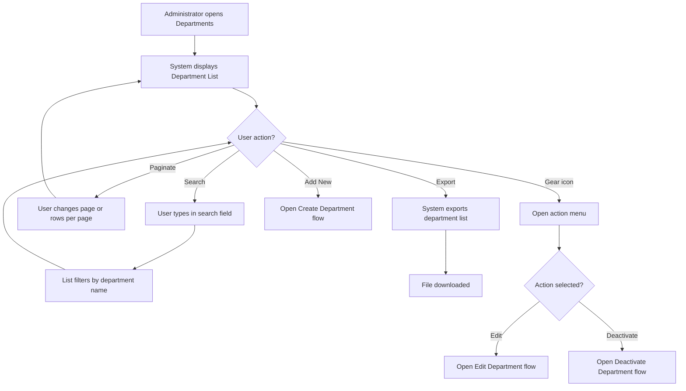
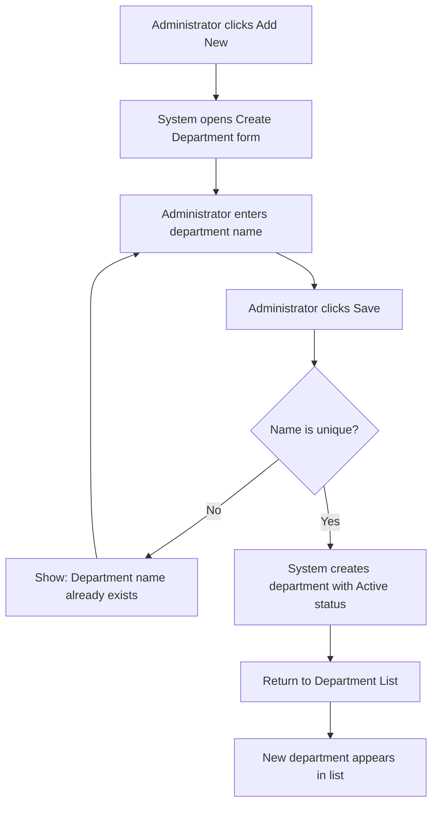
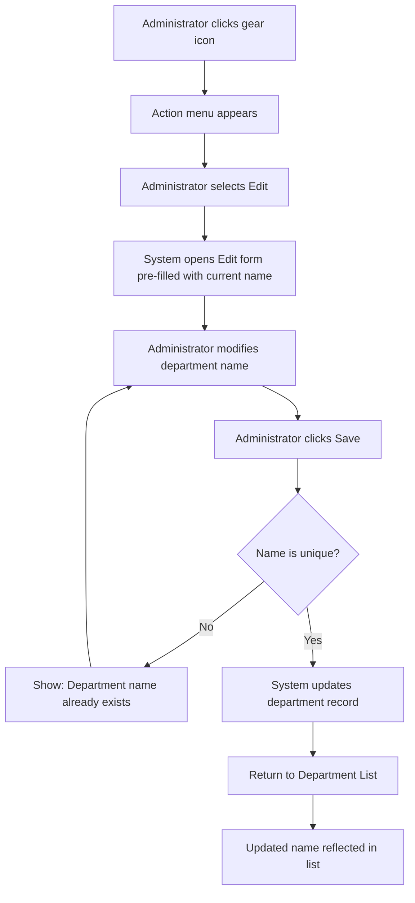
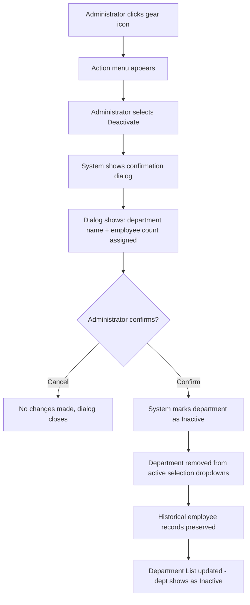
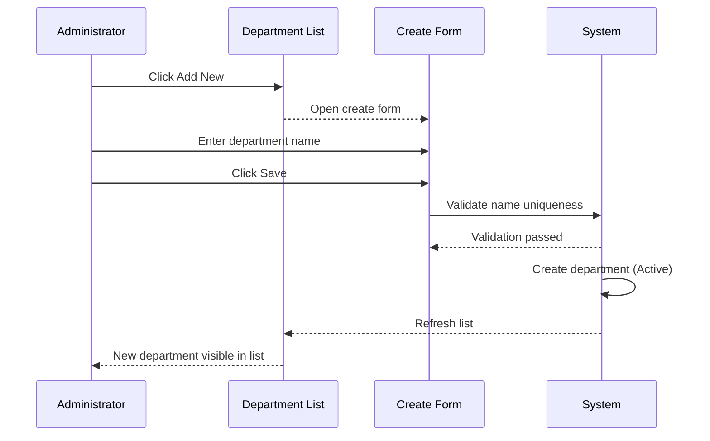
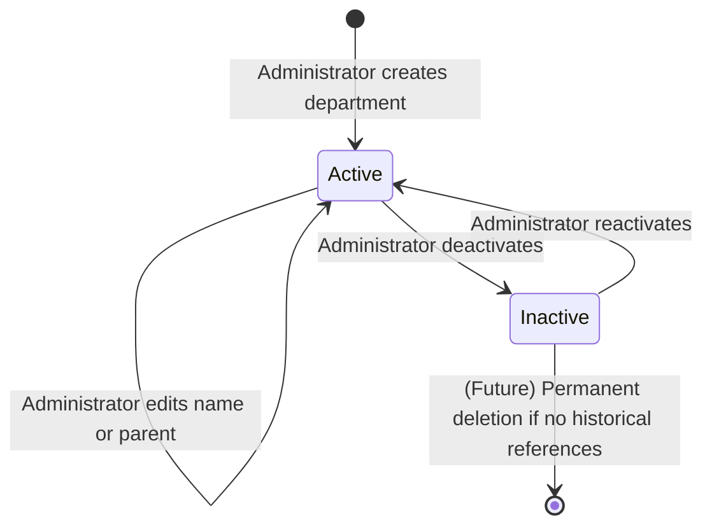

# Business Process Flowcharts: Department Management

**Epic:** EP-008 (Organization Data)
**Story:** US-001-department-management
**Last Updated:** 2026-03-03

---

## Table of Contents

1. [Department List Flow](#1-department-list-flow)
2. [Create Department Flow](#2-create-department-flow)
3. [Edit Department Flow](#3-edit-department-flow)
4. [Deactivate Department Flow](#4-deactivate-department-flow)
5. [Actor Interactions](#5-actor-interactions)
6. [State Diagram](#6-state-diagram)
7. [Notes & Assumptions](#7-notes--assumptions)

---

## 1. Department List Flow

---

## 2. Create Department Flow

### Key Steps

1. **Trigger** — Administrator clicks "Add New" button on Department List
2. **Name Entry** — Required field; validated for uniqueness on save
3. **Validation** — System checks name uniqueness
4. **Creation** — Department created as Active; list refreshes

---

## 3. Edit Department Flow

---

## 4. Deactivate Department Flow

### Key Steps

1. **Trigger** — Administrator selects Deactivate from gear menu
2. **Confirmation** — Dialog shows affected employee count to prevent accidental deactivation
3. **Deactivation** — Status set to Inactive; no data is deleted
4. **Cascade** — Department removed from all active dropdowns across modules
5. **Preservation** — Historical records unchanged

---

## 5. Actor Interactions

### Create Department Sequence

---

## 6. State Diagram

### Department Lifecycle States

**States:**
- **Active:** Department is available for employee assignment and visible in all active selection dropdowns
- **Inactive:** Department is deactivated; excluded from new assignments but preserved in historical records

---

## 7. Notes & Assumptions

### Assumptions

1. All department management actions require appropriate role permission (via US-004)
2. Departments are a flat list — no parent-child hierarchy (confirmed by Product Owner)
3. Search filters in real-time as user types (no submit required)
4. Export downloads the currently visible/filtered list

### Open Questions Affecting Flows

- Gear icon actions need confirmation — Edit + Deactivate confirmed, View TBD
- Reactivation flow not yet confirmed — is there a "reactivate" option for inactive departments?

---

**Document Control:**
- **Version:** 1.0
- **Status:** Draft
- **Last Updated:** 2026-03-03
