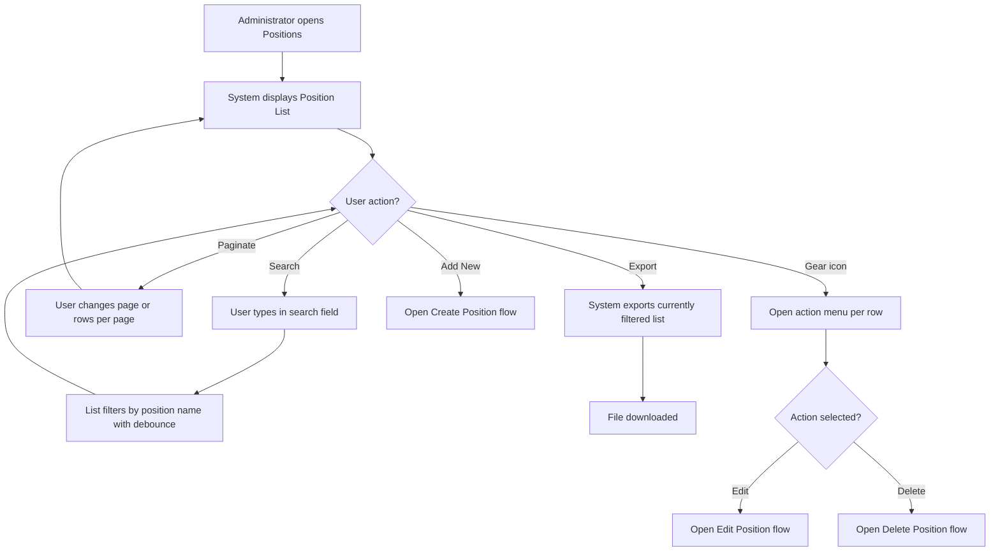
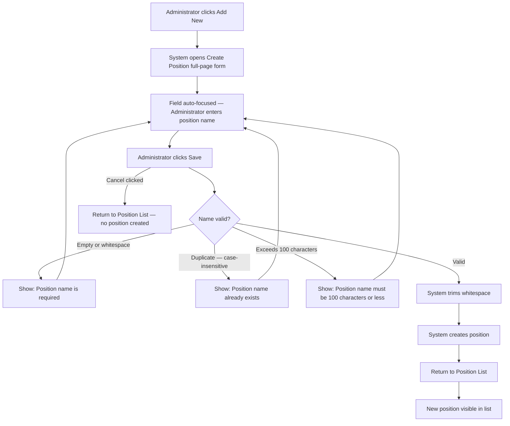
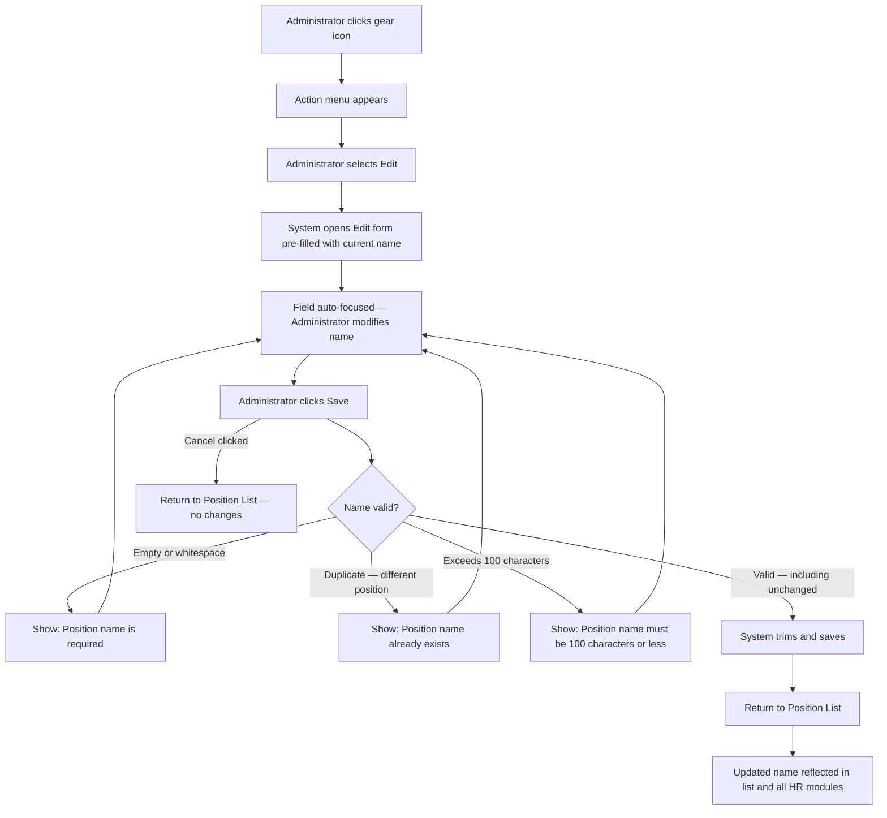
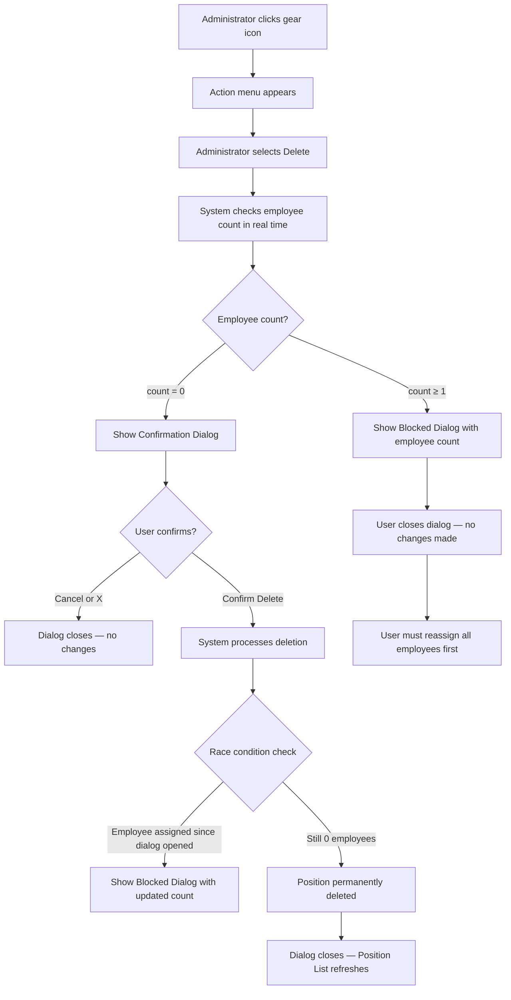
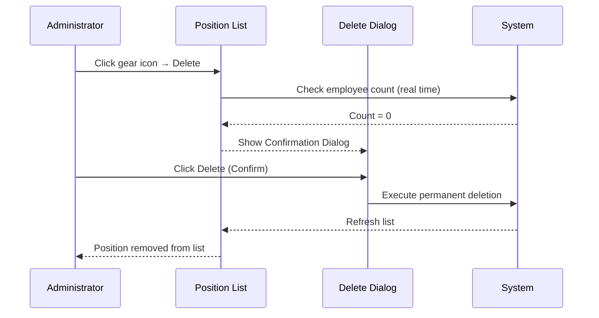
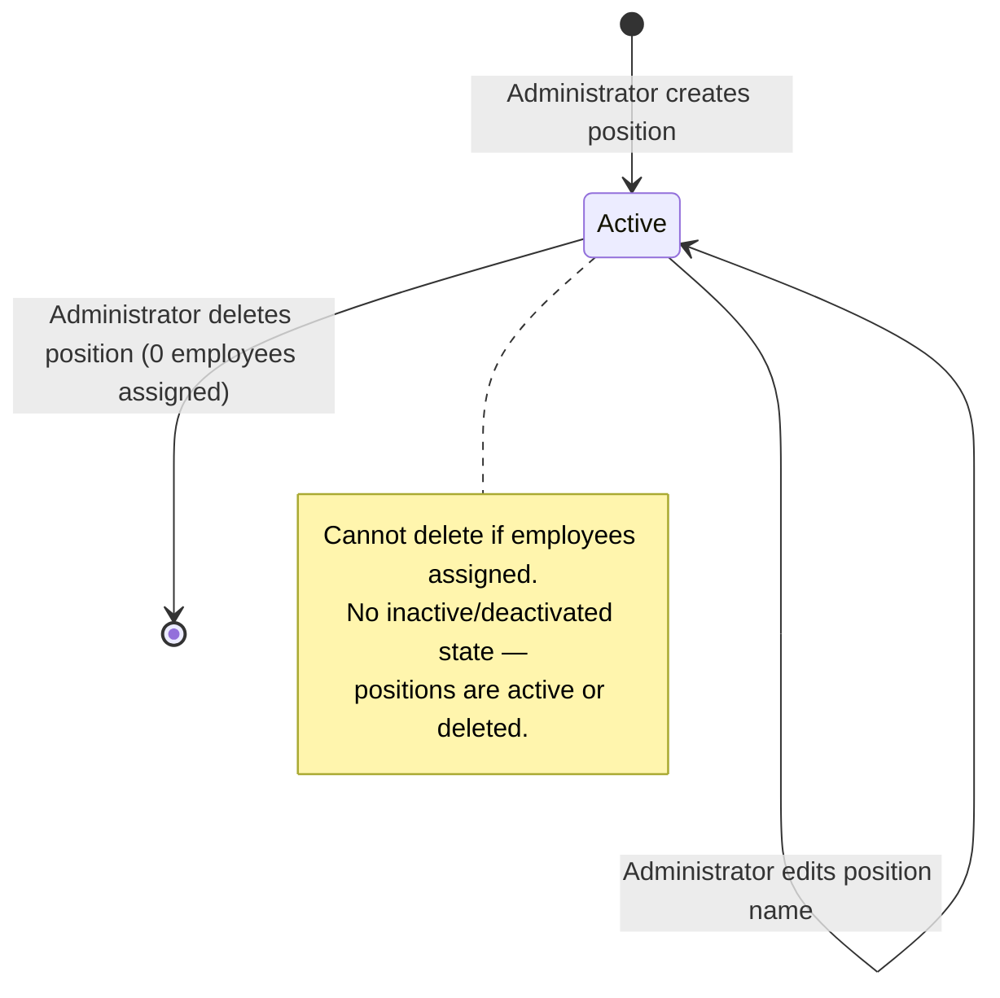

# Business Process Flowcharts: Position Management

**Epic:** EP-008 (Organization Data)
**Story:** US-002-position-management
**Last Updated:** 2026-03-05

---

## Table of Contents

1. [Main Process Flow — Position List](#1-main-process-flow--position-list)
2. [Create Position Flow](#2-create-position-flow)
3. [Edit Position Flow](#3-edit-position-flow)
4. [Delete Position Flow](#4-delete-position-flow)
5. [Decision Points](#5-decision-points)
6. [Actor Interactions](#6-actor-interactions)
7. [Data Flow](#7-data-flow)
8. [Error Handling](#8-error-handling)
9. [State Diagram](#9-state-diagram)
10. [Legend](#10-legend)
11. [Process Performance](#11-process-performance)

---

## 1. Main Process Flow — Position List



---

## 2. Create Position Flow



### Key Steps

1. **Trigger** — Administrator clicks "Add New" on Position List
2. **Form** — Full-page single-field form (position name only)
3. **Validation** — Required, unique (case-insensitive), max 100 characters
4. **Creation** — Position immediately available system-wide

---

## 3. Edit Position Flow



### Key Steps

1. **Trigger** — Administrator selects Edit from gear icon dropdown
2. **Form** — Full-page form identical to Create, pre-filled with current name
3. **Validation** — Uniqueness check excludes the current position (saving unchanged name is valid)
4. **Update** — Name immediately reflected across all HR modules

---

## 4. Delete Position Flow



### Key Steps

1. **Trigger** — Administrator selects Delete from gear icon dropdown
2. **Pre-check** — Employee count checked BEFORE any dialog is shown
3. **Blocked path** — If ≥1 employee: Blocked Dialog; no deletion attempted
4. **Confirmation path** — If 0 employees: Confirmation Dialog with irreversibility warning
5. **Race condition** — Count re-checked at execution time (server-side guard)
6. **Result** — Hard delete, permanent and irreversible

---

## 5. Decision Points

| Decision | Condition | Outcome A | Outcome B |
|----------|-----------|-----------|-----------|
| Name empty on save | Name is blank or whitespace-only | Show "Position name is required" error | Proceed to uniqueness check |
| Name duplicate on create | Name matches existing position (case-insensitive) | Show "Position name already exists" error | Create position |
| Name duplicate on edit | Name matches a different position (case-insensitive) | Show "Position name already exists" error | Save position |
| Employee count on delete | Count ≥ 1 | Show Blocked Dialog | Show Confirmation Dialog |
| Race condition | Employee assigned between dialog and confirm | Block at execution; show Blocked Dialog | Complete deletion |
| User action in Confirmation Dialog | Cancel or X | Close dialog; no changes | Confirm → delete |

---

## 6. Actor Interactions

### Create Position Sequence

```mermaid
sequenceDiagram
    participant Admin as Administrator
    participant PosList as Position List
    participant Form as Create Form
    participant System

    Admin->>PosList: Click Add New
    PosList-->>Form: Navigate to Create Position form

    Admin->>Form: Enter position name
    Admin->>Form: Click Save

    Form->>System: Validate (non-empty, unique, ≤100 chars)
    System-->>Form: Validation passed

    System->>System: Create position
    System-->>PosList: Navigate back; list refreshes
    PosList-->>Admin: New position visible in list
```

### Delete Position Sequence



---

## 7. Data Flow

```
[Position List page load]
  → System fetches all positions
  → System computes employee count per position (from EP-002)
  → Table displayed: Position Name | No. of Employees | Action (gear icon)

[Search applied]
  → Debounce (300ms) → System filters positions by name (case-insensitive contains)
  → Filtered results displayed → Pagination resets to page 1

[Create Position]
  → Form input → System validates (trim, unique, length)
  → Position record created → Immediately available in EP-002 employee selectors

[Edit Position]
  → Pre-filled form → System validates (trim, unique excluding self, length)
  → Position record updated → All EP-002 employee records reflect new name immediately

[Delete Position]
  → Real-time employee count from EP-002
  → If 0: hard delete executed → Position removed from EP-002 selectors
  → If ≥1: blocked → No data change

[Export]
  → Current filtered result set exported to file
  → File downloaded to user's browser
```

---

## 8. Error Handling

| Error Scenario | Trigger | User-Facing Message | Recovery |
|----------------|---------|---------------------|----------|
| Position name empty | Save with blank or whitespace-only name | "Position name is required" | User enters a valid name and resubmits |
| Position name duplicate | Save with name matching existing position | "Position name already exists" | User changes the name and resubmits |
| Position name too long | Save with name >100 characters | "Position name must be 100 characters or less" | User shortens the name and resubmits |
| Delete blocked | Delete attempted on position with ≥1 employee | "Cannot delete — [X] employees are assigned to this position. Reassign all employees before deleting." | User reassigns all employees, then reattempts |
| Race condition | Employee assigned between dialog open and confirm | Blocked Dialog shown with updated count | User closes dialog; reassigns employee |

---

## 9. State Diagram

### Position Lifecycle



**States:**
- **Active**: Position exists in the system; available for employee assignment and visible in all HR module position selectors
- **Deleted**: Position is permanently removed; no recovery possible; all employee assignments must be cleared first

---

## 10. Legend

| Symbol | Meaning |
|--------|---------|
| Rectangle | Process step or action |
| Diamond | Decision point (yes/no branch) |
| Rounded rectangle | Start / End state |
| Arrow | Flow direction |
| `[*]` in state diagram | Initial or terminal state |
| Solid line in sequence | Action sent |
| Dashed line in sequence | Response/result returned |

---

## 11. Process Performance

| Flow | Target Completion Time | Notes |
|------|----------------------|-------|
| Create position (happy path) | < 60 seconds | Single-field form; admin types name and saves |
| Edit position name | < 60 seconds | Pre-filled form; minimal edits required |
| Delete position (0 employees) | < 30 seconds | Confirmation dialog; one click to confirm |
| Search filter response | < 300ms after typing stops | Debounce applied; fast server-side filter |
| List page load | < 2 seconds | Standard HRM page load target |

---

**Document Control:**
- **Version:** 1.0
- **Status:** Draft
- **Last Updated:** 2026-03-05
