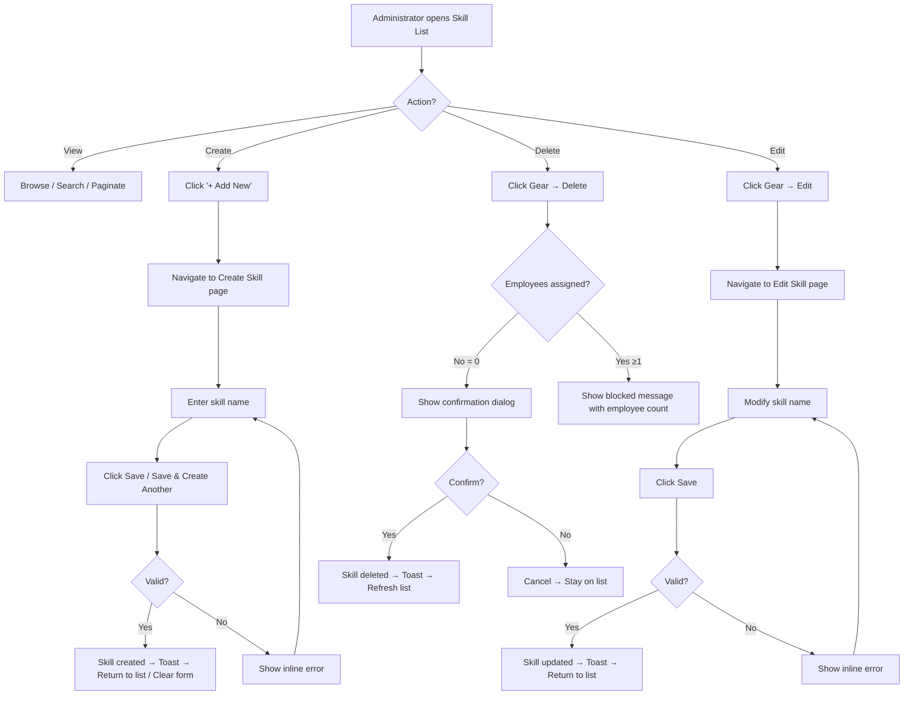

# Flowchart: Skill Management

**Epic:** EP-008 (Organization Data)
**Story:** US-003-skill-management
**Status:** Draft

---

## 1. Skill CRUD Flow

---

**Document Version:** 1.0
**Last Updated:** 2026-03-24
