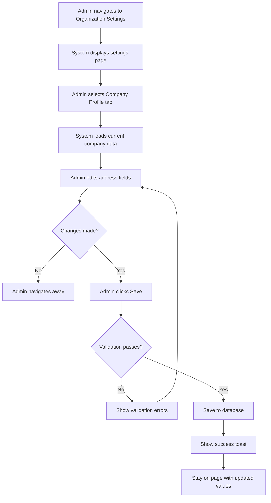
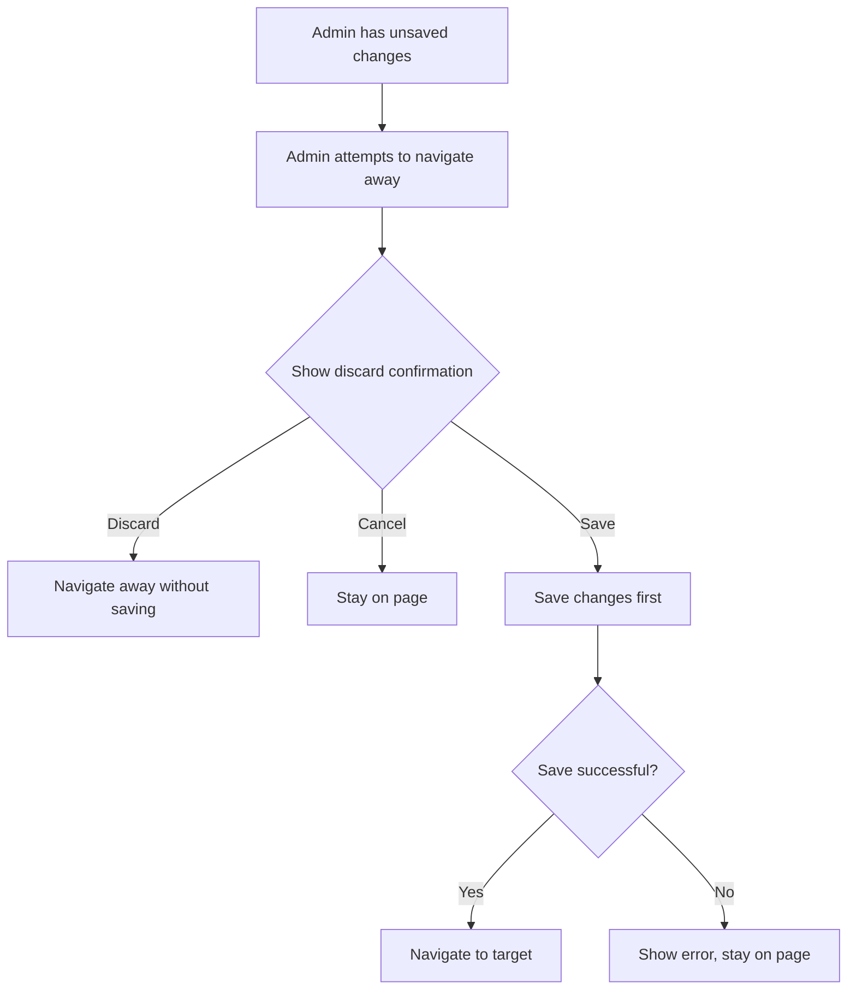

# Business Process Flowcharts: Company Profile

**Epic:** EP-009 (Organization Settings)
**Story:** US-001-company-profile
**Last Updated:** 2026-04-23

---

## 1. Update Company Address Flow

---

## 2. Dirty Form Navigation Flow

---

## Notes & Assumptions

### Notes

- Company Profile tab is part of the Organization Settings page
- Address changes are saved immediately upon clicking Save
- No approval workflow for profile changes

### Assumptions

- Only Admin/HR with organization settings permission can access
- Single company profile (no multi-tenant support)
