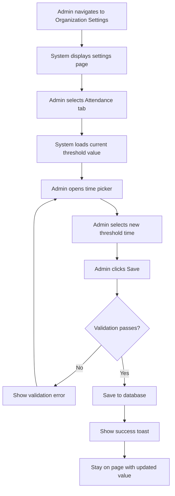
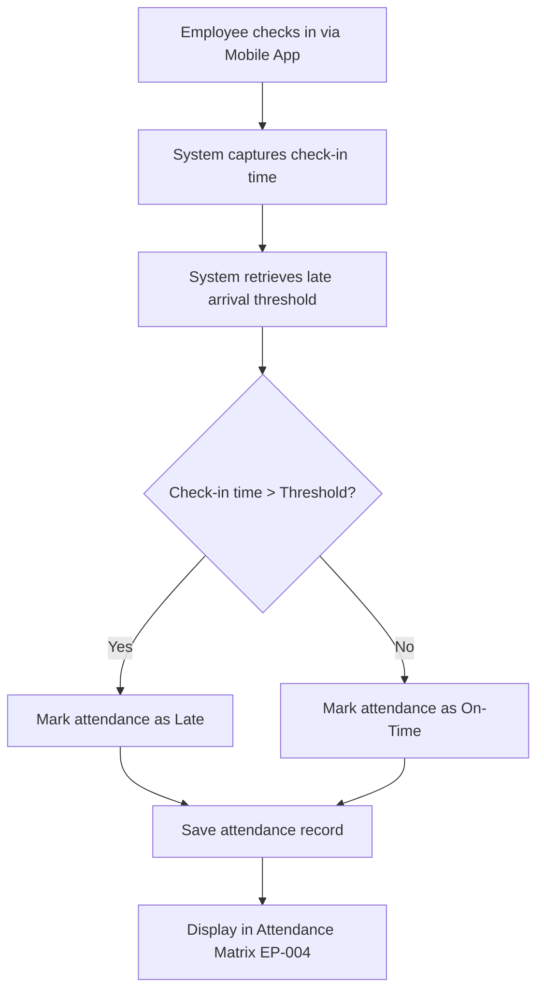
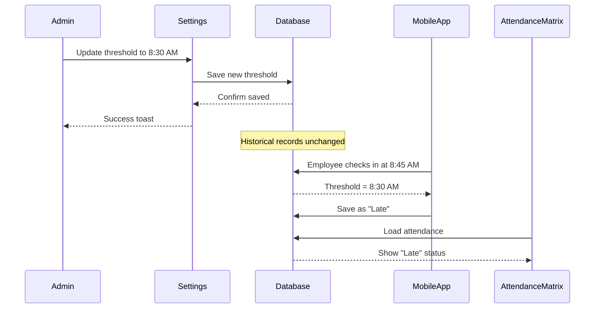

# Business Process Flowcharts: Attendance Settings

**Epic:** EP-009 (Organization Settings)
**Story:** US-002-attendance-settings
**Last Updated:** 2026-04-23

---

## 1. Configure Late Arrival Threshold Flow

---

## 2. Late Arrival Calculation Flow

---

## 3. Threshold Change Impact

---

## Notes & Assumptions

### Notes

- Threshold changes apply immediately to future check-ins
- Historical attendance records are not modified
- Mobile app reads threshold at check-in time

### Assumptions

- Single organization-wide threshold (no per-department)
- Time comparison uses same timezone for threshold and check-in
