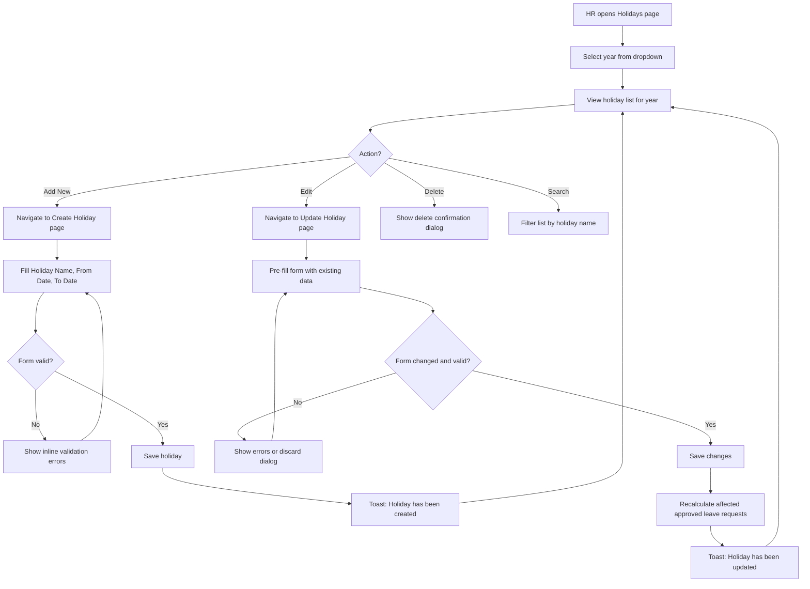
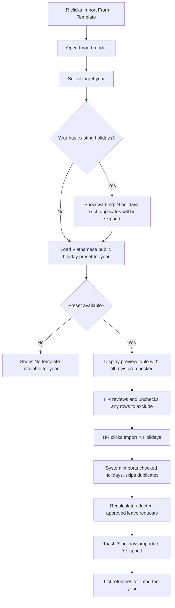
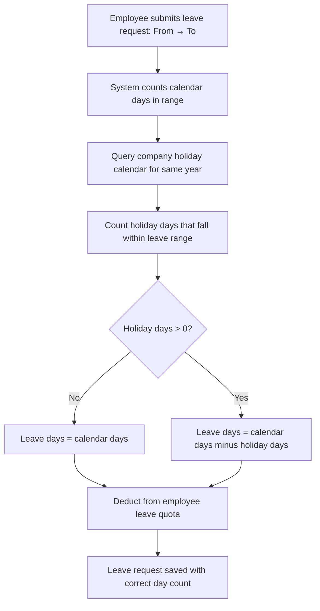
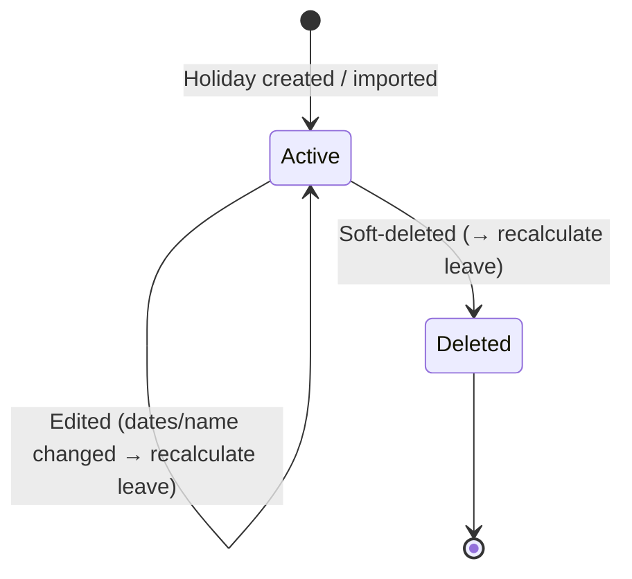

# Business Process Flowcharts: Holiday Management

**Epic:** EP-009 (Organization Settings)
**Story:** US-003-holiday-management
**Last Updated:** 2026-06-15

---

## Table of Contents

1. [Primary Process Flow — Holiday CRUD](#1-primary-process-flow--holiday-crud)
2. [Import From Template Flow](#2-import-from-template-flow)
3. [Delete & Leave Recalculation Flow](#3-delete--leave-recalculation-flow)
4. [Leave Day Calculation with Holidays](#4-leave-day-calculation-with-holidays)
5. [State Diagram](#5-state-diagram)
6. [Notes & Assumptions](#6-notes--assumptions)

---

## 1. Primary Process Flow — Holiday CRUD



---

## 2. Import From Template Flow



---

## 3. Delete & Leave Recalculation Flow

```mermaid
flowchart TD
    A[HR clicks Delete from gear menu] --> B[Show confirmation dialog]
    B --> C{HR confirms?}
    C -->|Cancel| D[Dialog closes, no change]
    C -->|Delete| E[Soft-delete holiday record]
    E --> F[Find all Approved leave requests overlapping deleted holiday dates]
    F --> G{Any affected requests?}
    G -->|No| H[Toast: Holiday has been deleted]
    G -->|Yes| I[Recalculate leave days for each affected request]
    I --> J[Update leave balance: holiday days re-added to consumed count]
    J --> K[Toast: Holiday deleted. N leave request(s) recalculated]
    H --> L[List refreshes]
    K --> L
```

---

## 4. Leave Day Calculation with Holidays



---

## 5. State Diagram



---

## 6. Notes & Assumptions

### Notes

- Holiday recalculation is triggered by: create (if overlaps existing approved leave), edit (date changes), delete
- Only `Approved` status leave requests are recalculated; Pending/Rejected/Cancelled are not affected
- Total Days is always computed: (To Date − From Date) + 1 calendar days (inclusive)
- The year filter on the list shows all years with at least one holiday + current year

### Assumptions

- Vietnamese public holiday preset is maintained within the system (no external API)
- A holiday spanning year boundaries (e.g., Dec 31 – Jan 2) belongs to the year of its From Date
- Half-day leave on a holiday date results in 0.5 holiday days excluded

### Open Questions

- [ ] Should employees receive a notification when their leave balance is auto-recalculated? — Owner: Product Owner
- [ ] Which roles have `organization.holidays.manage` permission by default? — Owner: Product Owner
