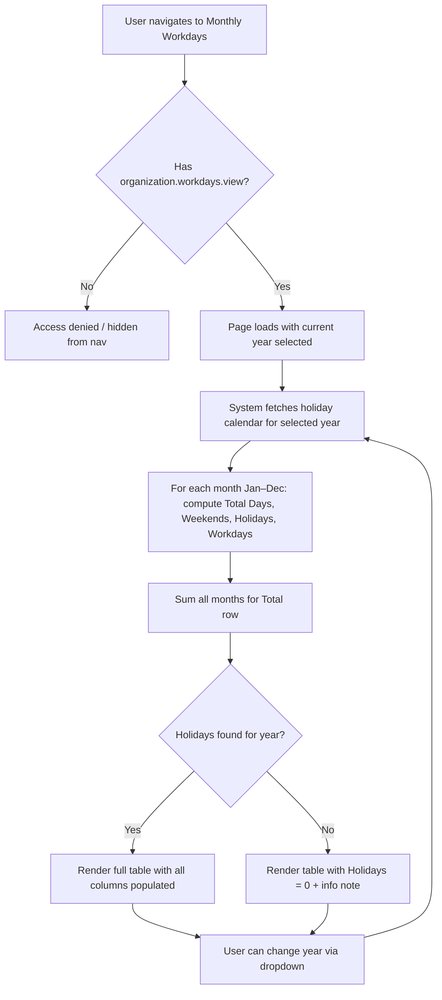
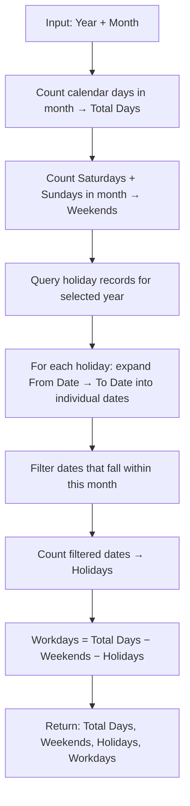
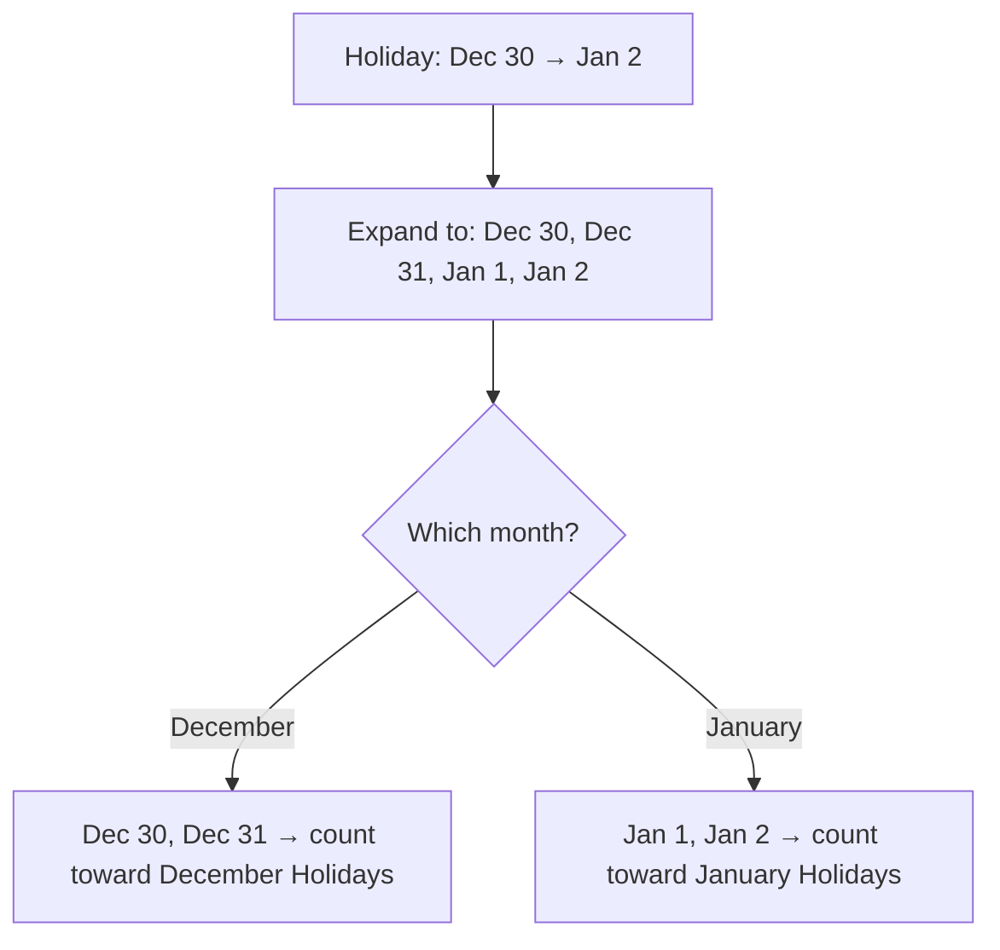

# Business Process Flowcharts: Monthly Workdays

**Epic:** EP-009 (Organization Settings)
**Story:** US-004-monthly-workdays
**Last Updated:** 2026-06-16

---

## 1. Primary Process Flow — Page Load & Display

---

## 2. Workday Calculation Flow (per month)

---

## 3. Edge Case — Cross-Month Holiday

---

## 4. Notes & Assumptions

### Notes
- Page is purely read-only — no user mutations
- Calculation runs live on every page load; holiday calendar changes reflect on next visit
- A holiday falling on a weekend still counts in Holidays (not discarded)
- Leap years handled automatically by the calendar day count

### Open Questions
- [ ] Should users without `organization.workdays.view` see the nav item (hidden) or see it greyed out? — Owner: Product Owner
