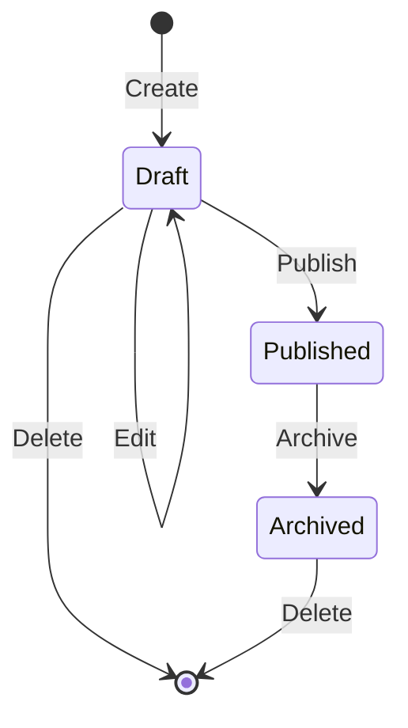
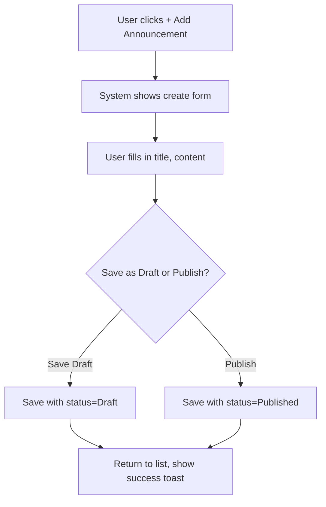
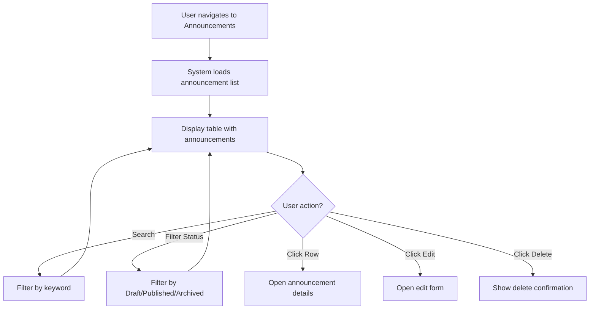

# Business Process Flowcharts: Announcement List

**Epic:** EP-010 (Announcements)
**Story:** US-001-announcement-list
**Last Updated:** 2026-04-25

---

## 1. Announcement Lifecycle Flow

---

## 2. Create Announcement Flow

---

## 3. View Announcement List Flow

---

## Notes & Assumptions

### Notes

- Announcements follow a simple lifecycle: Draft → Published → Archived
- Only Draft announcements can be edited
- Delete is a hard delete (no soft delete/restore)

### Assumptions

- Only Admin/HR can create and manage announcements
- All employees can view published announcements
- No approval workflow for announcements
